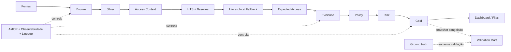

<div align="center">


# SoD Platform

**Access Governance · Data Engineering · Information Security**

POC para identificar e priorizar acessos **Padrão**, **Legítimos**, **Indevidos** e casos de **Revisão**, com explicabilidade, rastreabilidade e evolução planejada para SoD transacional.

[](https://github.com/Lal3x/SoD-Plataform/actions/workflows/ci.yml)
[](https://github.com/Lal3x/SoD-Plataform/actions/workflows/docs.yml)
[](https://github.com/Lal3x/SoD-Plataform/actions/workflows/cd.yml)


[Entender o problema](docs/negocio/problema-e-fases.md) ·
[Ver arquitetura](docs/arquitetura/arquitetura-atual.md) ·
[Resultados da POC](docs/resultados.md) ·
[Documentação completa](docs/index.md)

</div>

---

## O problema

Em ambientes grandes, responder **“este acesso deveria estar com esta pessoa?”** pode depender de entrevistas, conhecimento disperso e análise manual.

O objetivo desta solução é transformar esse processo em uma decisão baseada em dados, sem assumir que:

- um acesso frequente é automaticamente autorizado;
- um acesso raro é automaticamente indevido;
- ausência de evidência equivale a irregularidade.

A POC implementa a **Fase 1** do problema: limpeza, contextualização e governança de acessos. A evolução para **SoD transacional** fica na Fase 2, quando a análise passa a considerar combinações de funções e transações incompatíveis.

## O que a solução entrega

| Capacidade | Papel |
|---|---|
| **Contextualização do acesso** | relaciona identidade, entitlement, sigla, comunidade, temporalidade e demais fatos |
| **Baseline comportamental** | estima o que é comum para populações comparáveis |
| **Hierarchical Fallback** | evita conclusões frágeis quando grupos são pequenos |
| **Evidence** | organiza fatos, confiabilidade e contradições |
| **Policy** | aplica regras explícitas e reproduzíveis |
| **Risk** | prioriza os casos sem alterar a classificação |
| **Gold** | publica a decisão com lineage, versões e contexto |
| **Validation Mart** | avalia a solução sem contaminar o runtime com o gabarito |
| **Streamlit** | apresenta resultados, explicações e observabilidade |
| **Airflow** | coordena dependências, gates e execução do pipeline |

### Quatro resultados operacionais

| Decisão | Significado |
|---|---|
| **Padrão** | acesso coerente com o funcionamento esperado |
| **Legítimo** | acesso válido sustentado por autorização ou outra condição explícita de legitimidade |
| **Indevido** | condição suficiente para indicar remediação |
| **Revisão** | evidência insuficiente ou contraditória; exige análise humana |

## Arquitetura

A documentação distingue deliberadamente **a arquitetura conceitual inicial — a ideia de solução formulada no início do case — da arquitetura atual implementada**. A primeira registra o raciocínio de partida; a segunda mostra como esse raciocínio foi validado, refinado e transformado em componentes executáveis.



A arquitetura separa três responsabilidades que não devem ser confundidas:

**comportamento observado → evidência → decisão**.

Um acesso pode ser incomum e ainda ser legítimo. Da mesma forma, um acesso frequente pode continuar inadequado.

## Resultado da POC

O run validado de referência processou **75.577 acessos canônicos** em um dataset sintético com cenários conhecidos.

| Métrica | Resultado |
|---|---:|
| Acurácia exata | **94,64%** |
| Acurácia das decisões automatizadas | **95,86%** |
| Taxa de automação | **98,73%** |
| Casos enviados para revisão | **1,27%** |
| Indevidos tratados como seguros | **0** |
| Acessos válidos classificados como indevidos | **0** |

> Estes números demonstram o comportamento da POC em um ambiente sintético controlado. Eles **não representam uma estimativa de desempenho em produção**.

A análise completa, incluindo a principal oportunidade de calibração entre **Padrão** e **Legítimo**, está em [Resultados da POC](docs/resultados.md).

## Stack

| Camada | Tecnologias |
|---|---|
| Processamento | Python 3.12 · PySpark 4.1 |
| Armazenamento analítico | Apache Iceberg · Parquet |
| Consulta / apoio analítico | DuckDB · Pandas |
| Orquestração | Apache Airflow |
| Aplicação | Streamlit |
| Qualidade | Great Expectations · regras próprias de DQ |
| Testes | Pytest |
| Documentação | MkDocs Material |
| Containers | Docker · Docker Compose |
| CI/CD | GitHub Actions · GHCR |
| Arquitetura-alvo | AWS |

## Execução local

### Com Docker Compose

```bash
git clone https://github.com/Lal3x/SoD-Plataform.git
cd SoD-Plataform

cp .env.example .env
docker compose up --build
```

Serviços locais:

- **Streamlit:** `http://localhost:8501`
- **Airflow:** `http://localhost:8080`

### Com Poetry

Requer **Python 3.12** e **Java 17** para execução dos testes Spark.

```bash
poetry install

poetry run sod-bronze --help
poetry run sod-silver --help
poetry run sod-access-intelligence --help

poetry run pytest
```

Para a documentação:

```bash
poetry install --only docs
poetry run mkdocs serve
```

## Estrutura do repositório

```text
.
├── apps/streamlit/                  # dashboard e consumo
├── artifacts/                       # métricas e evidências de execução
├── configs/                         # parâmetros e contratos versionados
├── data/                            # dados locais / warehouse
├── docs/                            # documentação MkDocs
├── orchestration/airflow/           # DAGs e imagem do Airflow
├── scripts/
│   ├── runtime/                     # execução do pipeline
│   ├── validation/                  # validação offline
│   ├── operations/                  # rotinas operacionais
│   └── maintenance/                 # manutenção e utilitários
├── src/sod_platform/
│   ├── bronze/                      # ingestão
│   ├── silver/                      # canonicalização e qualidade
│   └── access_intelligence/         # contexto, baseline, evidence, policy e risk
└── tests/                            # unit, integration e e2e
```

## Princípios de engenharia e segurança

- **Frequência não é autorização.**
- **UNEXPECTED não significa INDEVIDO.**
- **Ausência de evidência não vira certeza artificial.**
- **Policy classifica; Risk prioriza.**
- **Gold publica, não inventa decisão.**
- **Ground truth fica fora do runtime.**
- **ML, grafos e LLM podem apoiar descoberta; política governada continua controlando a decisão.**
- **Regras, thresholds, snapshots e componentes são versionados para permitir auditoria.**

## Validação, testes e CI/CD

O projeto possui workflows separados para:

- **CI:** testes, build da documentação e build das imagens;
- **Documentação:** validação MkDocs e publicação via GitHub Pages;
- **CD:** publicação das imagens Streamlit e Airflow no GHCR.

A validação funcional também é separada do runtime: a solução produz e congela a Gold antes de consultar o gabarito.

## Fase 2 — evolução para SoD transacional

A fundação atual é reutilizada para evoluir de:

```text
Identidade × Entitlement × Sigla
```

para:

```text
Entitlement → Função → Transação → Ação → Objeto / Escopo
```

A proposta futura adiciona **Transaction Context**, **ML/Graph Analytics**, **LLM + RAG assistido**, **Semantic Access Catalog**, **SoD Policy Catalog** e **Conflict Engine**, mantendo decisões críticas sob regras formais e auditáveis.

Veja [Evolução para a Fase 2](docs/arquitetura/fase-2.md).

## Documentação

A documentação foi organizada para atender públicos diferentes:

- **Negócio / gestão:** [problema e duas fases](docs/negocio/problema-e-fases.md) → [regras de negócio](docs/negocio/regras-de-negocio.md) → [resultados](docs/resultados.md)
- **Segurança / auditoria:** [fundamentos de segurança](docs/arquitetura/fundamentos-seguranca.md) → [anatomia de uma decisão](docs/tecnica/anatomia-decisao.md) → [premissas e controles](docs/decisoes/limitacoes.md)
- **Engenharia de Dados:** [arquitetura](docs/arquitetura/arquitetura-atual.md) → [pipeline](docs/tecnica/pipeline.md) → [orquestração e observabilidade](docs/tecnica/orquestracao-observabilidade.md)
- **Avaliador técnico:** [arquitetura inicial](docs/arquitetura/arquitetura-inicial.md) → [evolução](docs/arquitetura/evolucao.md) → [rastreabilidade](docs/tecnica/rastreabilidade.md)

## Escopo e limitações

Esta é uma **POC** construída sobre dados sintéticos. Antes de uma promoção para produção seriam necessários, entre outros pontos:

- profiling e cobertura das fontes reais;
- calibração de thresholds;
- política institucional aprovada;
- chaves e histórico temporal corporativo;
- benchmark de volume, SLA e custo;
- rollout gradual com shadow run e revisão humana.

A documentação detalha essas condições em [Premissas, controles e evolução](docs/decisoes/limitacoes.md).

---

<div align="center">

**A POC demonstra método, arquitetura e comportamento controlado. Produção exige validação com dados e regras institucionais reais.**

</div>
