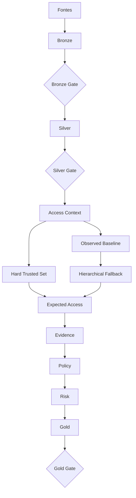
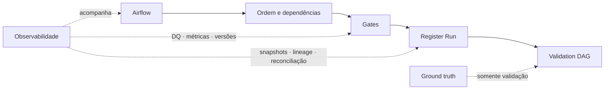

# Arquitetura atual

## 1. Arquitetura em duas leituras

O runtime atualmente implementado é materializado pelo DAG Airflow `sod_runtime_v2`, mas é mais fácil entendê-lo separando **o caminho que produz a decisão** do **caminho que controla a execução**.

!!! note "Sobre o nome técnico do DAG"
    O identificador `sod_runtime_v2` foi mantido no código por estabilidade técnica. Na documentação e na apresentação do case, esta solução é tratada simplesmente como **arquitetura atual**; o sufixo não representa uma versão arquitetural que o avaliador precise acompanhar.

!!! tip "Diagramas interativos"
    Os diagramas mantêm um tamanho legível. Use o scroll horizontal quando necessário ou **clique no diagrama para abrir em tela cheia e aplicar zoom**.

### 1.1 Data / decision path

O fluxo acima responde **como os dados viram uma decisão**. Cada estágio tem uma responsabilidade única; por isso comportamento observado, evidência, classificação e prioridade não ficam misturados.

### 1.2 Control path

O **control path** não decide o acesso. Ele garante que a execução ocorreu na ordem correta, com dados mínimos, versões conhecidas, rastreabilidade e validação isolada.

### 1.3 A leitura mais importante

| Camada | Pergunta respondida |
|---|---|
| Bronze / Silver | os dados chegaram e estão utilizáveis? |
| Context | o que sabemos sobre identidade, acesso e ambiente? |
| Baseline / Expected Access | esse acesso é comum para pares comparáveis? |
| Evidence | quais fatos sustentam ou contradizem o caso? |
| Policy | como as regras classificam o caso? |
| Risk | o que deve ser tratado primeiro? |
| Gold | como publicar a decisão de forma consumível e rastreável? |

## Segurança da Informação na arquitetura

A arquitetura atual não nasceu apenas de decisões de Engenharia de Dados. Vários componentes materializam princípios de Segurança da Informação que já orientavam a proposta conceitual inicial:

| Conceito | Como aparece na arquitetura |
|---|---|
| **Baseline comportamental** | Observed Baseline + Expected Access estabelecem uma referência antes da análise de desvios |
| **Least Privilege** | o objetivo é identificar acessos além do necessário, sem tratar raridade como prova |
| **Need-to-Know** | Access Context usa comunidade, função e contexto para avaliar necessidade funcional |
| **Segregation of Duties** | a Fase 2 evolui para conflitos entre funções e transações incompatíveis |
| **Defense in Depth** | DQ → contexto → baseline → Evidence → Policy → Risk evita depender de um único sinal |
| **Accountability / Auditabilidade** | reason codes, versões, snapshots, lineage e run registry permitem reconstruir a decisão |
| **Fail-safe diante de incerteza** | ausência de evidência suficiente produz UNKNOWN/REVISÃO em vez de uma conclusão forçada |

Veja a explicação completa em **[Fundamentos de Segurança da Informação](fundamentos-seguranca.md)**.
## 2. Preparação — Bronze

Bronze recebe as fontes e preserva a visão ingerida.

Seu objetivo não é “limpar” o dado até ele parecer bom. É registrar o que chegou, com metadados suficientes para reprocessamento e auditoria.

A observabilidade de Bronze registra volumes, arquivos, bytes, falhas e duração.

Depois da execução, Bronze Gate impede avanço se as tabelas obrigatórias estiverem ausentes ou vazias.

## 3. Curadoria — Silver

Silver transforma fontes heterogêneas em contratos canônicos.

Ela concentra:

- normalização;
- tipos;
- chaves;
- DQ;
- quarentena;
- persistência Iceberg.

O DAG usa a opção silver-only. Access Context é executado separadamente depois do Silver Gate.

Essa separação é importante porque canonicalização e interpretação do acesso são responsabilidades distintas.

## 4. Contexto e âncoras

Access Context monta a representação factual por grant.

HTS marca âncoras explícitas.

Esses dois componentes preparam a análise, mas ainda não classificam o acesso.

## 5. Baseline e Fallback

Observed Baseline materializa estatísticas em diferentes níveis de contexto.

Hierarchical Fallback escolhe o nível defensável para cada grant.

Se nenhum nível possui suporte, o pipeline preserva insuficiência de evidência.

## 6. Expected Access

Expected Access converte âncora e prevalência em uma expectativa analítica.

Ele responde:

- EXPECTED;
- UNEXPECTED;
- INSUFFICIENT_EVIDENCE.

Ele não responde “autorizado” ou “indevido”.

## 7. Evidence e Policy

Evidence normaliza fatos e confiabilidade.

Policy aplica regras explícitas e precedência.

Essa divisão é central: o mesmo Evidence Bundle pode ser reavaliado por uma nova versão de Policy sem reconstruir toda a contextualização.

## 8. Risk

Risk recebe a decisão e adiciona impacto.

A ordem é proposital:

  
<strong>1</strong>Policy classifica

  
<strong>2</strong>Risk prioriza

Se Risk viesse antes, impacto poderia contaminar a própria classificação.

## 9. Gold

Gold é contrato de consumo.

Ela reconcilia os componentes upstream e publica:

- decisão;
- evidências;
- expectedness;
- risco;
- fila operacional;
- versões;
- lineage.

Se a reconciliação falhar, o estágio não deve ser considerado válido.

## 10. Control path: por que Airflow importa

Airflow não está sendo usado apenas para “agendar scripts”.

Ele materializa dependências arquiteturais:

  
Expected Access válido<b>pré-condição</b>

  
Evidence válido<b>pré-condição</b>

  
Policy válida<b>pré-condição</b>

  
Gold congelada<b>antes da validação offline</b>

Também controla retry e max_active_runs para reduzir concorrência acidental sobre um warehouse local compartilhado.

## 11. Control path: observabilidade

A plataforma acompanha:

- saúde da ingestão;
- DQ e quarentena;
- execução por componente;
- contagem por estágio;
- versões;
- snapshots;
- lineage;
- reconciliação final.

Esse caminho de controle é tão importante quanto as transformações, porque uma decisão sem prova de origem não atende bem a requisitos de auditoria.

## 12. Runtime versus experimental

Peer Discovery existe em modo shadow.

LDA, FP-Growth, NMF-HDBSCAN e Leiden não participam de EA001, Evidence, Policy, Risk ou Gold do runtime atual.

Isso permite experimentação sem colocar um método ainda não aprovado no caminho crítico da decisão.

## 13. Runtime versus validação

  
<strong>1</strong>Runtime

  
<strong>2</strong>Gold congelada

  
<strong>3</strong>registro do run

  
<strong>4</strong>Validation DAG

  
<strong>5</strong>Validation Mart

O ground truth entra apenas na etapa de validação. A direção é unilateral.

## 14. Propriedades que a arquitetura atual busca

**Reprodutibilidade** — versões e snapshots explícitos.

**Explicabilidade** — regra, motivo e evidências por grant.

**Auditabilidade** — lineage, freeze e journal.

**Segurança de decisão** — incerteza não é escondida.

**Operabilidade** — gates, retry, health view e reconciliação.

**Evolutividade** — componentes podem receber a semântica transacional da Fase 2 sem reescrever a fundação.
