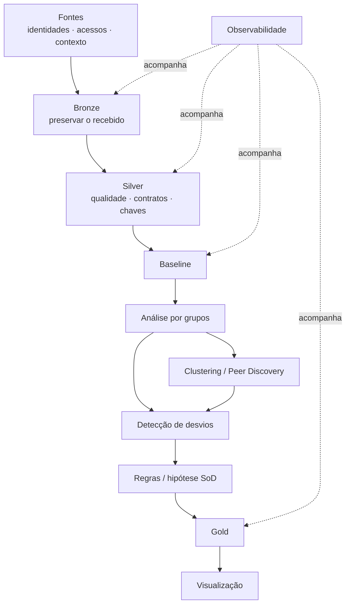
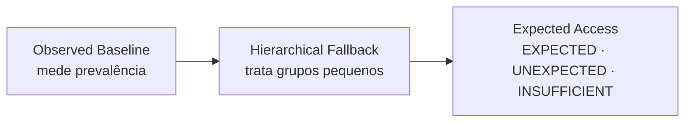
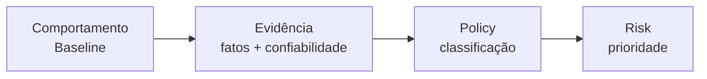
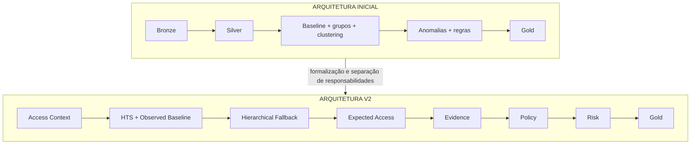

# Arquitetura inicial e fundamentos de Segurança da Informação

## 1. A arquitetura inicial já tinha uma tese

O desenho inicial não partiu apenas de ferramentas de Engenharia de Dados. Ele combinava **princípios de Segurança da Informação** com uma arquitetura capaz de executá-los em escala.

> **Não é possível identificar um desvio de acesso sem antes estabelecer uma referência de comportamento esperado, entender o contexto e preservar evidências suficientes para explicar a decisão.**

A V2 não substituiu esse raciocínio. Ela **formalizou responsabilidades que inicialmente estavam agrupadas**.

## 2. Segurança da Informação já orientava a solução

| Princípio | Como aparecia desde o início | Como foi formalizado depois |
|---|---|---|
| **Baseline comportamental** | estabelecer uma referência antes de procurar desvios | Observed Baseline + Fallback + Expected Access |
| **Least Privilege** | questionar acessos além do necessário | Policy + revisão de acessos |
| **Need-to-Know** | interpretar o acesso pelo contexto funcional | Access Context + comunidade + função |
| **Anomaly Detection** | localizar comportamentos fora do padrão | Expected Access, sem transformar raridade em culpa |
| **Segregation of Duties** | hipótese de matriz SoD | Fase 2 transacional |
| **Accountability** | necessidade de decisão explicável e observável | lineage + snapshots + versões + reason codes |
| **Defense in Depth** | não depender de um único sinal | DQ → contexto → baseline → Evidence → Policy → Risk |

!!! info "Leitura correta"
    **Engenharia de Dados fornece escala, contratos e rastreabilidade. Segurança da Informação fornece os princípios que determinam o que observar, comparar e proteger.**

Veja também a página dedicada **[Fundamentos de Segurança da Informação](fundamentos-seguranca.md)**.

## 3. A baseline não surgiu na V2

Desde o início, a análise por grupos e a detecção de anomalias já pressupunham uma baseline.

A implementação V2 apenas tornou essa ideia explícita:

Isso é diferente de autorização.

> **Um acesso pode ser frequente e ainda assim contrariar uma regra. Frequente ≠ autorizado. Raro ≠ indevido.**

## 4. O bloco analítico inicial já continha várias hipóteses

| Ideia inicial | Pergunta que já existia | Formalização posterior |
|---|---|---|
| análise por grupos | com quem esta pessoa deve ser comparada? | grupos comparáveis |
| baseline | o que é normal neste contexto? | Observed Baseline |
| clustering / peer discovery | existem grupos naturais além do organograma? | experimentos shadow |
| anomaly detection | o que foge do comportamento esperado? | Expected Access |
| regras | o que fazer com os sinais encontrados? | Evidence + Policy |
| matriz SoD | quais capacidades não deveriam coexistir? | Fase 2 transacional |
| Gold | como disponibilizar a decisão? | GOLD001 |
| observabilidade | consigo confiar e reconstruir a execução? | métricas, lineage, snapshots e reconciliação |

## 5. O principal refinamento: separar sinal de decisão

Na arquitetura inicial, análise de padrão, desvio e regra estavam concentradas no mesmo bloco. A V2 separou três perguntas diferentes:

| Pergunta | Responsabilidade |
|---|---|
| **É comum?** | Baseline + Expected Access |
| **É justificável?** | Evidence organiza fatos, aprovações, birthright, certificações e contexto |
| **Como classificar?** | Policy aplica regras explícitas; Risk prioriza depois |

Essa separação evita que uma anomalia estatística seja tratada diretamente como violação.

## 6. O que a implementação acrescentou

A V2 não inventou as preocupações originais; ela resolveu ambiguidades que aparecem quando a ideia vira software:

- formalizou contexto organizacional e temporal;
- criou âncoras explícitas de alta confiança;
- transformou a baseline em contrato versionado;
- tratou grupos pequenos com fallback hierárquico;
- separou expectedness de autorização;
- registrou confiabilidade e contradições de evidência;
- separou Policy de Risk;
- isolou validação do runtime;
- colocou experimentos de ML/Graph em shadow mode;
- transformou observabilidade em mecanismo operacional.

## 7. Da arquitetura inicial à V2

A ideia central foi preservada. O que mudou foi o nível de formalização, testabilidade e auditabilidade.

## 8. Por que ML e grafos ficaram em shadow mode na Fase 1

Clustering, LDA, NMF-HDBSCAN, FP-Growth e grafos foram mantidos como experimentos porque a Fase 1 precisa privilegiar:

- explicabilidade;
- previsibilidade;
- rastreabilidade;
- testabilidade.

Isso não reduz o valor dessas técnicas. Elas ganham mais relevância na Fase 2, quando a plataforma passa a analisar padrões funcionais e transacionais mais complexos.

## 9. Por que a matriz SoD completa fica na Fase 2

A SoD transacional precisa de uma semântica mais profunda:

**Fase 1:** limpar, contextualizar e governar os acessos.

**Fase 2:** usar essa fundação para avaliar acumulações transacionais conflitantes.

## 10. Leitura correta da evolução

> **A arquitetura inicial já identificava baseline, análise por grupos, descoberta de padrões, anomalias, regras, SoD, publicação e observabilidade. A implementação V2 transformou essas capacidades em componentes independentes, seguros e auditáveis.**
