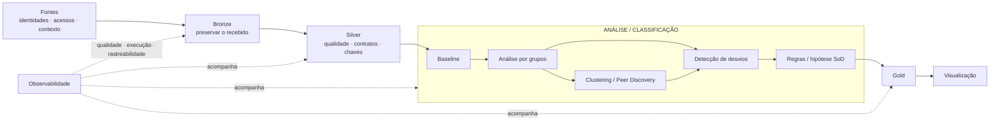

# Arquitetura inicial e fundamentos de Segurança da Informação

## 1. A arquitetura inicial já tinha uma tese

O desenho inicial não partiu apenas de ferramentas de Engenharia de Dados. Ele partiu de uma combinação de **princípios de Segurança da Informação** com uma arquitetura capaz de executá-los em escala.

> **não é possível identificar um desvio de acesso sem antes estabelecer uma referência de comportamento esperado, entender o contexto e preservar evidências para explicar a decisão.**

A V2 não substituiu esse raciocínio. Ela **formalizou responsabilidades que inicialmente estavam agrupadas**.

## 2. Segurança da Informação já orientava a solução

  
Baseline<h3>Normal antes do desvio</h3>
Estabelecer uma referência de comportamento esperado antes de procurar anomalias. Na V2 isso foi formalizado em Observed Baseline, Fallback e Expected Access.

  
Least Privilege<h3>Menor privilégio</h3>
A pergunta central sempre foi se a pessoa realmente precisa daquele acesso para o seu contexto, evitando permissões além do necessário.

  
Need-to-Know<h3>Contexto importa</h3>
Um acesso fora da comunidade não é automaticamente errado; ele precisa ser interpretado à luz da necessidade funcional e de evidências de autorização.

  
Anomaly Detection<h3>Desvio é sinal</h3>
Comportamento raro ajuda a direcionar investigação, mas não é tratado sozinho como prova de irregularidade.

  
SoD<h3>Separação de responsabilidades</h3>
A hipótese de matriz SoD já existia; a evolução separou a sanitização da Fase 1 da análise transacional mais profunda da Fase 2.

  
Accountability<h3>Decisão auditável</h3>
Gold e observabilidade já eram necessidades do desenho inicial. A V2 materializou lineage, snapshots, versões e reason codes.

!!! info "Leitura correta"
    **A Engenharia de Dados fornece escala, contratos e rastreabilidade; Segurança da Informação fornece os princípios que determinam o que observar, comparar e proteger.**

### Como esses princípios viraram arquitetura

  
<b>Baseline + monitoramento comportamental</b>motivaram comparação por grupos, prevalência e identificação de desvios.

  
<b>Least Privilege</b>orientou a busca por acessos além do necessário, sem transformar raridade em culpa.

  
<b>Need-to-Know</b>levou ao uso de comunidade, função e contexto para interpretar a necessidade do acesso.

  
<b>Segregation of Duties</b>manteve desde o início o horizonte de detectar combinações incompatíveis de capacidades.

  
<b>Accountability e auditoria</b>motivaram Gold, observabilidade, lineage, snapshots, reason codes e versionamento.

  
<b>Defesa em camadas</b>aparece na separação entre qualidade, contexto, comportamento, evidência, política e risco.

## 3. A baseline não surgiu na V2

Desde o início, a análise por grupos e a detecção de anomalias pressupunham uma baseline.

O raciocínio era:

  
<strong>1</strong>definir população comparável

  
<strong>2</strong>entender o comportamento normal

  
<strong>3</strong>identificar desvios

  
<strong>4</strong>investigar com contexto e regras

A implementação V2 apenas tornou essa ideia explícita:

  

    
<strong>Observed Baseline</strong><small>mede prevalência em grupos comparáveis</small>

    
→

    
<strong>Hierarchical Fallback</strong><small>amplia a comparação quando o grupo é pequeno</small>

    
→

    
<strong>Expected Access</strong><small>esperado, inesperado ou evidência insuficiente</small>

  

Isso é diferente de autorização. Um acesso pode ser frequente e ainda assim contrariar uma regra.

## 4. O bloco analítico inicial já continha várias hipóteses

| Ideia inicial | Pergunta que já existia | Formalização posterior |
|---|---|---|
| análise por grupos | com quem esta pessoa deve ser comparada? | grupos comparáveis |
| baseline | o que é normal neste contexto? | Observed Baseline |
| clustering / peer discovery | existem grupos naturais além do organograma? | experimentos shadow |
| anomaly detection | o que foge do comportamento esperado? | Expected Access |
| regras | o que fazer com os sinais encontrados? | Evidence + Policy |
| matriz SoD | quais capacidades não deveriam coexistir? | Fase 2 transacional |
| Gold | como disponibilizar a decisão? | GOLD001 |
| observabilidade | consigo confiar e reconstruir a execução? | métricas, lineage, snapshots e reconciliação |

## 5. O principal refinamento: separar sinal de decisão

  
Comportamento<h3>É comum?</h3>
Baseline e Expected Access medem aderência a um padrão observado.

  
Autorização<h3>É justificável?</h3>
Evidence organiza fatos como approval, birthright, certificação e contexto.

  
Decisão<h3>Como classificar?</h3>
Policy aplica regras explícitas; Risk define prioridade depois da classificação.

> **frequente ≠ autorizado e raro ≠ indevido.**

## 6. O que a implementação acrescentou

A V2 não “inventou” as preocupações originais; ela resolveu ambiguidades que aparecem quando a ideia vira software:

- formalizou contexto organizacional e temporal;
- criou âncoras explícitas de alta confiança;
- transformou a baseline em contrato versionado;
- tratou grupos pequenos com fallback hierárquico;
- separou expectedness de autorização;
- registrou confiabilidade e contradições de evidência;
- separou Policy de Risk;
- isolou validação do runtime;
- colocou experimentos de ML/Graph em shadow mode;
- transformou observabilidade em mecanismo operacional.

## 7. Da arquitetura inicial à V2

  

    Arquitetura inicial
    <h3>Capacidades agrupadas</h3>
    
Bronze → Silver → baseline / grupos / clustering / anomalias / regras → Gold

  

  
→

  

    Arquitetura V2
    <h3>Responsabilidades explícitas</h3>
    
Context → HTS → Baseline/Fallback → Expected Access → Evidence → Policy → Risk → Gold

  

A ideia central foi preservada. O que mudou foi o nível de formalização, testabilidade e auditabilidade.

## 8. Por que ML e grafos ficaram em shadow mode na Fase 1

Clustering, LDA, NMF-HDBSCAN, FP-Growth e grafos foram mantidos como experimentos porque a Fase 1 precisa privilegiar explicabilidade, previsibilidade, rastreabilidade e testabilidade.

Isso não reduz o valor dessas técnicas. Elas se tornam ainda mais relevantes na Fase 2, quando a plataforma passa a analisar padrões funcionais e transacionais mais complexos.

## 9. Por que a matriz SoD completa fica na Fase 2

  
<strong>1</strong>entitlement

  
<strong>2</strong>função

  
<strong>3</strong>transação

  
<strong>4</strong>ação

  
<strong>5</strong>objeto / escopo

> **Fase 1:** limpar, contextualizar e governar os acessos.  
> **Fase 2:** usar essa fundação para avaliar acumulações transacionais conflitantes.

## 10. Leitura correta da evolução

> **A arquitetura inicial já identificava baseline, análise por grupos, descoberta de padrões, anomalias, regras, SoD, publicação e observabilidade. A implementação V2 transformou essas capacidades em componentes independentes, seguros e auditáveis.**
