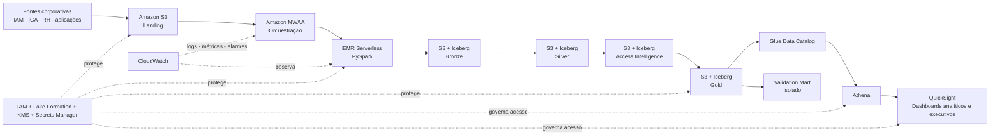
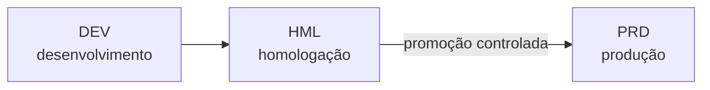
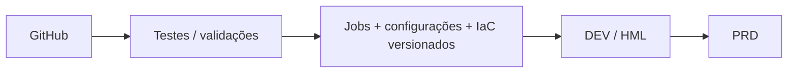

# Arquitetura alvo na AWS

!!! info "Leitura opcional"
    Esta página descreve **como a solução poderia ser operada em cloud**. Ela não é necessária para entender as regras da POC e não representa infraestrutura já implantada.

## 1. Princípio

A migração para AWS não deve mudar a semântica da solução. Ela deve mudar **como a plataforma executa, escala, protege e observa** seus componentes.

Esta página descreve arquitetura-alvo, não infraestrutura já implantada.

## 2. Escolha principal para processamento: EMR Serverless

A implementação atual é PySpark batch orientado por DAG.

Para esse perfil, a opção principal proposta é **Amazon EMR Serverless**.

Motivos:

- preserva Spark/PySpark;
- não exige cluster permanentemente ligado;
- encaixa bem em jobs disparados pelo Airflow;
- permite escalar por workload;
- reduz gestão de nós para uma POC evoluindo a plataforma.

EMR em cluster continua sendo alternativa quando houver necessidade de workloads persistentes, controle mais fino de infraestrutura ou tuning específico.

AWS Glue ETL também é alternativa possível, mas não é o alvo principal desta proposta.

## 3. Mapeamento

| Atual | AWS alvo | Função |
|---|---|---|
| data/raw | S3 Landing | ingestão |
| Iceberg warehouse | S3 | armazenamento |
| catálogo local | Glue Data Catalog | catálogo |
| PySpark | EMR Serverless | processamento |
| Airflow local | MWAA | orquestração |
| Streamlit local | QuickSight | dashboards analíticos e executivos |
| logs | CloudWatch | observabilidade |
| segredos | Secrets Manager | credenciais |
| autorização data lake | IAM + Lake Formation | governança |
| criptografia | KMS | proteção |
| consulta ad hoc | Athena | exploração |
| auditoria cloud | CloudTrail | trilha administrativa |

Na POC local, o **Streamlit** continua sendo útil para demonstração, investigação e operação assistida. Na arquitetura-alvo AWS, a camada de visualização passa a ser **QuickSight**, consumindo a Gold por meio do **Athena**. Com isso, o dashboard deixa de exigir uma aplicação containerizada dedicada e, para essa finalidade, **ECS Fargate e ECR deixam de ser necessários**.

## 4. Arquitetura

## 5. Ambientes

Produção bancária não deve compartilhar estado entre desenvolvimento, homologação e produção.

Arquitetura recomendada:

Cada ambiente deve possuir:

- buckets próprios;
- catálogo próprio;
- roles próprias;
- secrets próprios;
- logs próprios;
- parâmetros próprios.

## 6. Isolamento do Validation Mart

Uma das fronteiras mais importantes é runtime versus validação.

O role usado pelo runtime não deve ter acesso ao ground truth.

| Role | Responsabilidade | Acesso ao gabarito |
|---|---|---|
| **Runtime role** | lê Bronze/Silver e produz Intelligence/Gold | **não** |
| **Validation role** | lê Gold congelada e ground truth para medir a execução | **sim, somente para validação** |

Isso transforma prevenção de leakage em controle de infraestrutura.

## 7. Rede

MWAA e EMR Serverless devem operar em rede controlada. A camada analítica usa Athena e QuickSight com acesso governado por IAM e Lake Formation.

Quando aplicável:

- sub-redes privadas;
- security groups restritivos;
- endpoints privados;
- S3 sem exposição pública;
- acesso corporativo autenticado e autorizado aos dashboards do QuickSight.

## 8. Segurança e governança

### IAM

Roles distintas para:

- runtime;
- validation;
- consumo analítico / QuickSight;
- CI/CD.

### Lake Formation

Permissões de tabela/coluna para separar runtime, validação, exploração e consumo analítico pelo QuickSight.

### KMS

Criptografia para S3, logs e demais recursos persistentes.

### Secrets Manager

Nenhum segredo deve depender de arquivo versionado no Git.

## 9. Observabilidade na AWS

CloudWatch centraliza a **observabilidade técnica**:

- status e duração dos jobs;
- falha de gates;
- erros de execução;
- volume por estágio;
- métricas operacionais do pipeline.

QuickSight concentra a **visualização analítica e executiva**:

- distribuição de Policy;
- taxa de revisão;
- risco por comunidade;
- filas e tendências;
- indicadores de negócio derivados da Gold.

CloudTrail complementa com auditoria administrativa.

Os snapshots Iceberg continuam sendo parte da rastreabilidade de dados.

## 10. CI/CD

A infraestrutura deveria ser declarada em IaC conforme padrão organizacional, por exemplo Terraform, CDK ou CloudFormation. Jobs, configurações, permissões e ativos analíticos devem seguir promoção controlada entre ambientes; a arquitetura não depende mais de publicar uma imagem de dashboard em ECR.

## 11. Data Mesh

Data Mesh é tratado como lente de ownership, não como motor do pipeline.

Exemplo:

- domínio de Identidade publica identidade;
- IGA publica grants/requests/certificações;
- domínio de aplicações publica criticidade e função;
- SoD consome esses contratos.

Medallion organiza processamento. Data Mesh organiza responsabilidade.

## 12. O que não muda ao ir para cloud

Mesmo na AWS:

- frequência continua não sendo autorização;
- Evidence continua separado de Policy;
- Risk continua posterior à decisão;
- Gold continua sem criar inteligência;
- Validation continua isolada;
- shadow experiments continuam fora do runtime.

Cloud aumenta capacidade operacional. Não substitui disciplina de decisão.
