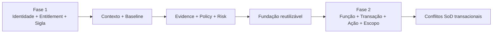
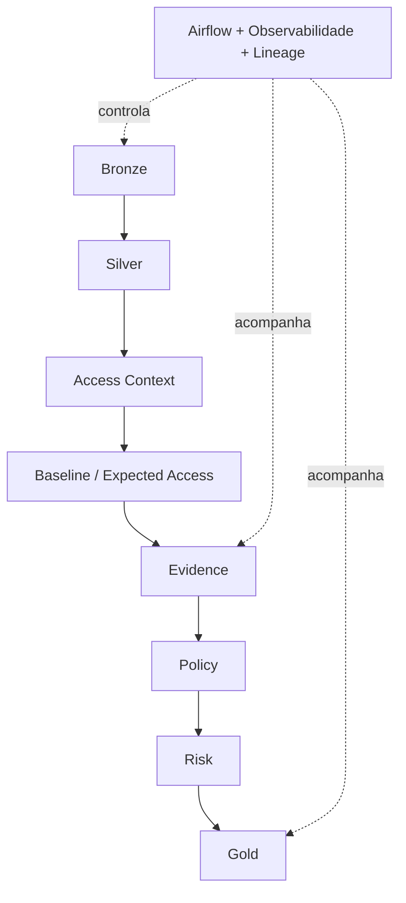
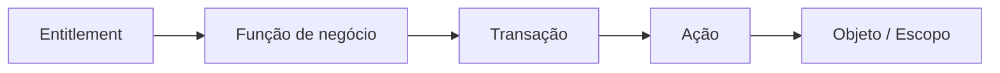
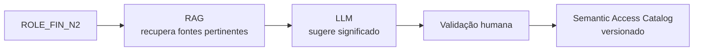
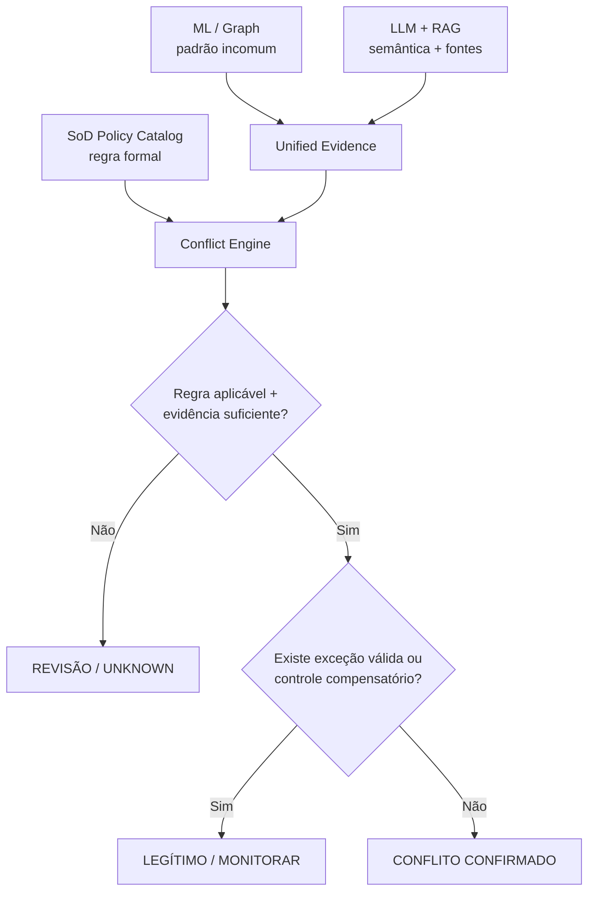
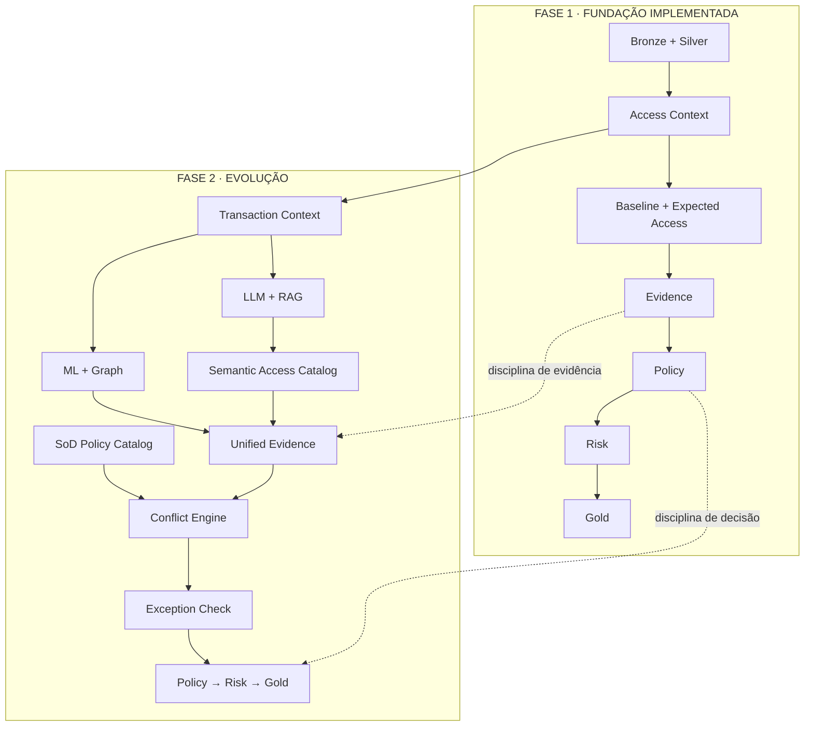
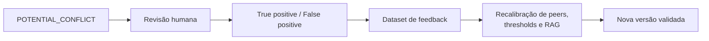

# Evolução para a Fase 2 — SoD transacional + inteligência assistida

## Resumo executivo

A Fase 2 **não substitui a Fase 1**. Ela reutiliza a mesma fundação de contexto, evidência, política, risco, observabilidade e rastreabilidade e adiciona profundidade semântica para responder:

> **A combinação de capacidades desta identidade cria um conflito real dentro de um processo de negócio?**

A evolução proposta adiciona cinco capacidades principais:

| Capacidade | Papel |
|---|---|
| **Transaction Context** | mapear entitlement → função → transação → ação → objeto/escopo |
| **ML + Graph Analytics** | descobrir peers, padrões naturais, combinações raras e sinais anômalos |
| **LLM + RAG** | interpretar catálogos, políticas e manuais com fontes recuperadas |
| **SoD Policy Catalog** | versionar conflitos aprovados, escopo, vigência, exceções e controles |
| **Conflict Engine** | confirmar conflitos a partir de regras formais e contexto suficiente |

!!! important "Princípio da Fase 2"
    **ML, Graph e LLM + RAG ampliam descoberta e contexto. Eles não substituem a política governada e não decidem sozinhos que um acesso é indevido.**

Para os princípios de Segurança da Informação que sustentam essa evolução, consulte **[Fundamentos de Segurança da Informação](fundamentos-seguranca.md)**.

## 1. Da Fase 1 para a Fase 2

A Fase 1 pergunta:

> **Este acesso faz sentido para esta identidade neste contexto?**

A Fase 2 acrescenta:

> **Estas capacidades, quando acumuladas, permitem executar etapas incompatíveis do mesmo processo?**

## 2. A fundação da Fase 1 continua

A Fase 2 reutiliza essa disciplina. O que muda é a quantidade de semântica disponível para interpretar o acesso.

## 3. Transaction Context: entender o que o acesso permite fazer

Para SoD transacional, entitlement e sigla não bastam. Precisamos chegar a uma representação funcional:

Exemplo:

| Entitlement | Processo | Função | Ação |
|---|---|---|---|
| `ENT_AP_001` | Contas a Pagar | Pagamento | Criar |
| `ENT_AP_017` | Contas a Pagar | Pagamento | Aprovar |

Se a mesma identidade possui as duas capacidades, existe um **candidato a conflito**. A confirmação depende de regra formal, escopo, vigência, exceção e controles compensatórios.

## 4. ML e Graph Analytics: descobrir padrões

ML e grafos podem ampliar a capacidade de descoberta da plataforma, principalmente para:

- encontrar grupos funcionais que não aparecem claramente no organograma;
- descobrir peers mais comparáveis;
- identificar combinações recorrentes de funções;
- localizar combinações raras ou inesperadas;
- detectar comunidades de acesso, hubs e relações incomuns;
- sugerir candidatos a novas regras SoD.

!!! warning "Sinal não é decisão"
    Uma combinação rara ou anômala gera um **POTENTIAL_CONFLICT** para investigação. Ela não vira automaticamente `INDEVIDO`.

## 5. LLM + RAG: interpretar significado e documentação

O LLM entra como **camada semântica assistida**. O RAG recupera documentação corporativa pertinente antes da resposta, por exemplo:

- catálogo de aplicações;
- descrição de roles e entitlements;
- documentação de transações;
- políticas de Segurança da Informação;
- procedimentos;
- matriz SoD;
- exceções aprovadas;
- controles compensatórios;
- achados históricos validados.

O objetivo não é transformar a resposta do modelo em verdade. É acelerar a construção de um catálogo semântico governado.

### RAG com temporalidade e escopo

Os documentos recuperados devem carregar metadados como:

- aplicação;
- processo;
- função;
- versão;
- `valid_from`;
- `valid_to`;
- escopo organizacional;
- owner;
- classificação.

Assim, uma política futura ou fora de escopo não influencia indevidamente uma avaliação histórica.

## 6. SoD Policy Catalog

O catálogo formal contém regras aprovadas e versionadas.

| Campo | Exemplo |
|---|---|
| `rule_id` | `SOD_FIN_017` |
| função A | `CADASTRAR_FORNECEDOR` |
| função B | `APROVAR_PAGAMENTO` |
| processo | Contas a Pagar |
| escopo | mesma entidade / domínio |
| criticidade | HIGH |
| vigência | versionada |
| exceção permitida | sob condições |
| controle compensatório | revisão independente |

É esse catálogo — **não o LLM** — que sustenta o Conflict Engine.

## 7. Como controlar falsos positivos

A arquitetura combina sinais independentes e preserva incerteza:

Isso evita dois atalhos perigosos:

- **raro = indevido**;
- **LLM sugeriu = conflito confirmado**.

## 8. Arquitetura combinada

**Airflow, observabilidade, temporalidade, lineage e versionamento continuam atravessando as duas fases.**

## 9. Feedback governado

Casos enviados para revisão podem melhorar os componentes de descoberta sem alterar silenciosamente a política:

Esse feedback pode melhorar ML, peer groups, mapeamentos semânticos e RAG. Mudanças no **SoD Policy Catalog** continuam exigindo aprovação e versionamento.

## 10. Roadmap proposto

1. incorporar fontes de função, transação, ação e escopo;
2. construir o **Transaction Context**;
3. versionar o **Semantic Access Catalog**;
4. usar ML/Graph para descoberta;
5. incorporar LLM + RAG como camada semântica assistida;
6. validar sugestões antes de promovê-las ao catálogo;
7. construir o **SoD Policy Catalog**;
8. executar Conflict Engine + Exception Check;
9. reutilizar Evidence → Policy → Risk → Gold;
10. medir `precision`, `false-positive rate`, `false-safe rate`, `review rate` e `automation rate` antes de ampliar automação.

## Síntese

> **ML e LLM aumentam a cobertura de descoberta. Evidence e Policy continuam controlando a decisão.**
