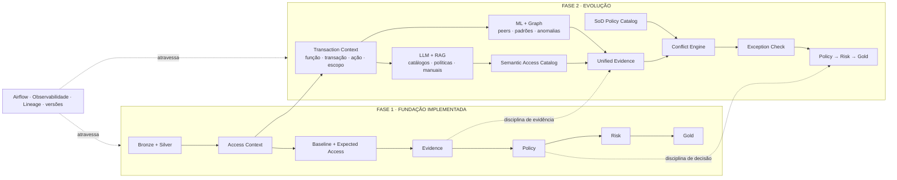

# Evolução para a Fase 2 — SoD transacional + inteligência assistida

## Resumo executivo

A Fase 2 não substitui a Fase 1. Ela **reutiliza sua fundação** e adiciona profundidade semântica para responder uma pergunta mais difícil:

> **A combinação de capacidades desta identidade cria um conflito real dentro de um processo de negócio?**

Para isso, a evolução prevista adiciona:

  
Semântica<h3>Transaction Context</h3>
Mapear entitlement → função → transação → ação → objeto/escopo.

  
Descoberta<h3>ML + Graph Analytics</h3>
Encontrar peers, padrões naturais, combinações raras e sinais de comportamento anômalo.

  
Conhecimento<h3>LLM + RAG</h3>
Interpretar catálogos, políticas e manuais para sugerir mapeamentos semânticos e candidatos a conflito.

  
Governança<h3>SoD Policy Catalog</h3>
Versionar conflitos aprovados, escopo, vigência, exceções e controles compensatórios.

  
Controle<h3>Conflict Engine</h3>
Confirmar conflitos somente com regras formais e contexto suficiente.

  
Continuidade<h3>Evidence → Policy → Risk</h3>
Reutilizar a mesma disciplina de decisão explicável construída na Fase 1.

!!! important "Princípio da Fase 2"
    **ML, Graph e LLM + RAG ampliam descoberta e contexto; eles não substituem a política governada nem decidem sozinhos que um acesso é indevido.**

<strong>Em resumo:</strong> a Fase 2 mantém Bronze, Silver, contexto, evidência, Policy, Risk, Gold, Airflow e observabilidade. O que adicionamos é <strong>semântica transacional</strong>, descoberta de padrões com <strong>ML/Graph</strong> e interpretação assistida de conhecimento com <strong>LLM + RAG</strong>. Esses componentes geram sinais e candidatos; a decisão continua dependente de regras SoD aprovadas, exceções e controles compensatórios.

## 1. O que muda em relação à Fase 1

A Fase 1 responde:

> “Este acesso faz sentido para esta identidade neste contexto?”

A Fase 2 acrescenta:

> “Estas capacidades, quando acumuladas, permitem executar etapas incompatíveis do mesmo processo?”

Para isso, entitlement e sigla deixam de ser suficientes.

  
<strong>1</strong>entitlement

  
<strong>2</strong>função

  
<strong>3</strong>transação

  
<strong>4</strong>ação

  
<strong>5</strong>objeto / escopo

## 2. A fundação da Fase 1 continua

  
Núcleo reutilizado

  

    
<strong>Bronze</strong><small>ingestão rastreável</small>

    
→

    
<strong>Silver</strong><small>contratos + DQ</small>

    
→

    
<strong>Context</strong><small>identidade + acesso</small>

    
→

    
<strong>Evidence</strong><small>fatos + confiabilidade</small>

    
→

    
<strong>Policy</strong><small>decisão governada</small>

    
→

    
<strong>Risk</strong><small>prioridade</small>

    
→

    
<strong>Gold</strong><small>consumo</small>

  

  
<strong>Airflow + Observabilidade + Lineage</strong>continuam atravessando as duas fases

## 3. Nova camada semântica

Um conflito SoD exige saber o que o acesso permite fazer.

  
ENT_AP_001<h3>Cadastrar pagamento</h3>
Contas a Pagar → Pagamento → Criar.

  
ENT_AP_017<h3>Aprovar pagamento</h3>
Contas a Pagar → Pagamento → Aprovar.

Se a mesma identidade possui as duas capacidades, existe um **candidato a conflito**. A confirmação ainda depende de regra formal, escopo, vigência, exceção e controles compensatórios.

## 4. ML e Graph Analytics: descobrir padrões

Na Fase 2, ML e grafos deixam de ser apenas experimentos de apoio e podem ganhar um papel maior de descoberta.

Eles podem ajudar a encontrar:

- grupos funcionais que não aparecem claramente no organograma;
- peers realmente comparáveis;
- combinações recorrentes de funções;
- combinações raras ou inesperadas;
- comunidades de acesso;
- hubs e relações incomuns;
- novos candidatos a regras SoD.

A saída continua sendo um **sinal**, não uma decisão.

  ML / Graph
  <strong>Padrão incomum detectado</strong>
  
Resultado: <b>POTENTIAL_CONFLICT</b> ou candidato para investigação.

## 5. LLM + RAG: entender significado e documentação

O LLM entra como **camada semântica assistida**.

O RAG fornece ao modelo documentos corporativos relevantes antes da resposta, por exemplo:

- catálogo de aplicações;
- descrição de roles;
- catálogo de entitlements;
- documentação de transações;
- políticas de segurança;
- procedimentos;
- matriz SoD;
- exceções aprovadas;
- controles compensatórios;
- achados históricos já validados.

O objetivo é transformar nomes técnicos pouco expressivos em semântica de negócio.

  

    Entrada técnica
    <h3>ROLE_FIN_N2</h3>
    
Nome isolado com pouco significado para a análise.

  

  
→

  

    LLM + RAG
    <h3>Contas a Pagar · Fornecedor · Cadastrar</h3>
    
Mapeamento sugerido com fontes recuperadas e confiança explícita.

  

### O LLM não vira fonte da verdade

A saída desejada é:

~~~text
sugestão semântica
        ↓
fontes utilizadas
        ↓
confidence
        ↓
validação humana / governança
        ↓
Semantic Access Catalog versionado
~~~

O catálogo aprovado passa a alimentar o runtime. A resposta livre do LLM não deve ser usada diretamente como regra de produção.

## 6. RAG com temporalidade e escopo

Uma política recuperada pelo RAG só é útil se for pertinente ao caso.

Por isso os documentos devem carregar metadados como:

- aplicação;
- processo;
- função;
- tipo de documento;
- versão;
- valid_from;
- valid_to;
- escopo organizacional;
- classificação;
- owner.

Isso preserva uma disciplina já presente na Fase 1:

> **evidência futura ou fora de escopo não deve influenciar uma decisão histórica.**

## 7. SoD Policy Catalog

O catálogo formal mantém regras aprovadas, por exemplo:

| Campo | Exemplo |
|---|---|
| rule_id | SOD_FIN_017 |
| função A | CADASTRAR_FORNECEDOR |
| função B | APROVAR_PAGAMENTO |
| processo | Contas a Pagar |
| escopo | mesma entidade / mesmo domínio |
| criticidade | HIGH |
| vigência | versionada |
| exceção permitida | sim, sob condições |
| controle compensatório | revisão independente |

É esse catálogo governado — e não o LLM — que sustenta o Conflict Engine.

## 8. Como controlar falsos positivos

A arquitetura usa o mesmo princípio da Fase 1: **sinal não é decisão**.

  
Do sinal à decisão

  

    
<strong>ML / Graph</strong><small>padrão ou combinação incomum</small>

    
+

    
<strong>LLM + RAG</strong><small>semântica + fontes</small>

    
→

    
<strong>Unified Evidence</strong><small>corroboração e qualidade</small>

    
→

    
<strong>SoD Rule</strong><small>regra aprovada e vigente</small>

    
→

    
<strong>Exception Check</strong><small>exceção + controle compensatório</small>

  

A plataforma distingue:

  
Confirmed<h3>Conflito confirmado</h3>
Regra formal aplicável, contexto suficiente e nenhuma exceção válida.

  
Potential<h3>Possível conflito</h3>
Sinais relevantes existem, mas ainda falta evidência para decisão automática.

  
Unknown<h3>Evidência insuficiente</h3>
O sistema preserva incerteza em vez de forçar uma resposta.

## 9. Como a decisão final continua governada

  
1<h3>ML / Graph</h3>
Descobre peers, padrões raros e combinações incomuns.

  
2<h3>LLM + RAG</h3>
Interpreta catálogos, políticas e documentação com fontes recuperadas.

  
3<h3>Transaction Context</h3>
Função, transação, ação, objeto, escopo e vigência.

  
4<h3>SoD Catalog</h3>
Regras formais, versionadas e aprovadas.

  
5<h3>Unified Evidence + Exception Check</h3>
Corrobora sinais, verifica confiabilidade, exceções e controles compensatórios.

  
6<h3>Policy → Risk → Gold</h3>
Decisão governada, prioridade e publicação usando a mesma fundação da Fase 1.

  
<strong>Princípio</strong>IA amplia descoberta; regras aprovadas continuam controlando a decisão.

O resultado final pode reutilizar a filosofia da Fase 1:

- **PADRÃO** — nenhuma incompatibilidade aplicável;
- **LEGÍTIMO** — situação sensível, porém coberta por exceção ou controle aprovado;
- **INDEVIDO** — conflito confirmado e sem justificativa válida;
- **REVISÃO** — sinais existem, mas a evidência ainda não permite automação segura.

## 10. Arquitetura combinada

A Fase 2 **não cria uma segunda plataforma**. Ela reutiliza a fundação da Fase 1 e acrescenta contexto transacional, descoberta assistida e um catálogo governado de conflitos.

## 11. O que pretendemos fazer

Em uma implementação futura, a sequência proposta é:

1. incorporar fontes que descrevam função, transação, ação e escopo;
2. construir o **Transaction Context**;
3. versionar um **Semantic Access Catalog**;
4. usar ML/Graph para descobrir peers, padrões e candidatos;
5. usar LLM + RAG para acelerar interpretação de documentação e mapeamentos;
6. validar sugestões humanas antes de torná-las catálogo de produção;
7. construir o **SoD Policy Catalog**;
8. executar o **Conflict Engine** com regras aprovadas;
9. verificar exceções e controles compensatórios;
10. alimentar o mesmo fluxo de Evidence → Policy → Risk → Gold;
11. medir falsos positivos, taxa de revisão e estabilidade antes de qualquer automação ampla.

## 12. Feedback e redução contínua de falsos positivos

Casos enviados para **REVISÃO** viram uma fonte de aprendizado operacional, sem permitir que o feedback humano altere silenciosamente a Policy.

  
<strong>1</strong>candidato gerado

  
<strong>2</strong>revisão humana

  
<strong>3</strong>true/false positive registrado

  
<strong>4</strong>recalibração governada

Esse feedback pode melhorar peer groups, thresholds, mapeamentos semânticos e prompts/RAG, mas mudanças no **SoD Policy Catalog** continuam exigindo aprovação e versionamento.

Métricas propostas para essa fase incluem **precision, false-positive rate, review rate, automation rate e false-safe rate**. O objetivo não é maximizar automação; é automatizar somente onde a evidência é suficientemente forte.

## 13. Por que essa evolução é coerente

A Fase 1 já construiu as disciplinas difíceis:

- contratos de dados;
- contexto;
- baseline;
- temporalidade;
- evidência;
- confiabilidade;
- política explícita;
- risco;
- versionamento;
- lineage;
- observabilidade;
- validação separada.

A Fase 2 adiciona **semântica e novas fontes de inteligência**, sem abandonar essas garantias.

> **ML e LLM aumentam cobertura de descoberta. Evidence e Policy continuam controlando a decisão.**
