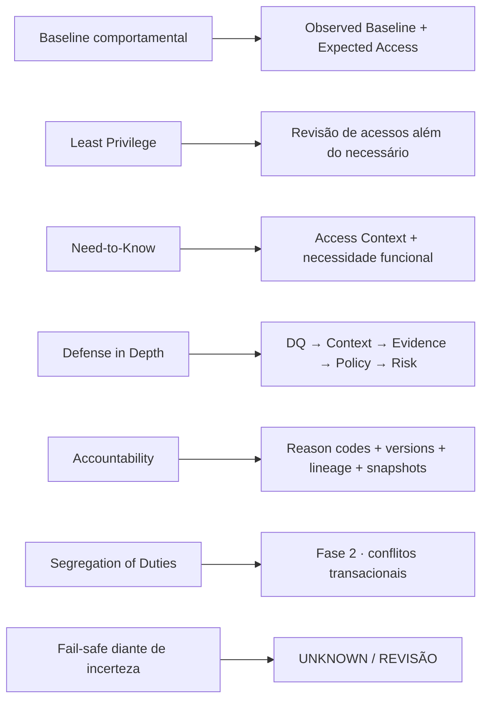
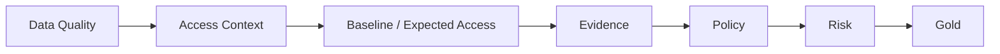
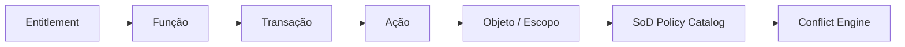

# Fundamentos de Segurança da Informação

Esta solução combina **Engenharia de Dados** e **Segurança da Informação**. A Engenharia de Dados fornece escala, contratos, processamento e rastreabilidade; Segurança da Informação orienta **o que comparar, o que proteger e quando uma evidência é suficiente para decidir**.

## Do princípio à arquitetura

## 1. Baseline antes do desvio

Desde o início, a solução partiu da ideia de que **não existe desvio sem uma referência de comportamento esperado**.

Isso aparece em:

- análise por grupos comparáveis;
- prevalência de acessos;
- identificação de comportamento comum ou incomum;
- tratamento de grupos pequenos;
- separação entre comportamento e autorização.

Na implementação V2, esse princípio foi formalizado em:

**Observed Baseline → Hierarchical Fallback → Expected Access**.

!!! important
    A baseline responde **“isso é comum?”**. Ela não responde **“isso é autorizado?”**.

## 2. Least Privilege

O princípio do menor privilégio aparece na pergunta central da plataforma:

> **esta identidade possui apenas os acessos necessários para sua função e contexto?**

A solução não remove automaticamente tudo que é raro. Em vez disso, procura evidências que permitam distinguir:

- acesso padrão;
- exceção legítima;
- acesso potencialmente indevido;
- caso que exige revisão.

## 3. Need-to-Know e contexto

Acesso não é analisado isoladamente. O contexto organizacional e funcional importa.

Por isso o **Access Context** reúne comunidade, cargo, squad, tipo de identidade, aplicação, temporalidade, aprovação, certificação e demais sinais relevantes.

Um acesso entre comunidades pode ser legítimo. O que importa é se existe **necessidade funcional e evidência suficiente** para sustentá-lo.

## 4. Defense in Depth

A plataforma não depende de uma única heurística.

Cada camada reduz um tipo diferente de risco:

- DQ impede decisões sobre dados estruturalmente inválidos;
- Context evita interpretação sem contexto;
- Baseline mede comportamento;
- Evidence registra fatos e confiabilidade;
- Policy aplica regras explícitas;
- Risk define prioridade sem alterar a classificação.

## 5. Accountability e auditabilidade

Uma decisão de segurança precisa ser explicável e reconstruível.

A arquitetura preserva:

- versões de regra e método;
- reason codes;
- snapshots;
- lineage;
- run registry;
- reconciliação;
- evidências utilizadas.

Isso permite responder **qual dado entrou, qual versão processou, qual regra decidiu e por que o resultado foi produzido**.

## 6. Falhar com segurança diante da incerteza

A solução evita converter ausência de informação em certeza.

Exemplos:

- telemetria incompleta não significa “nunca usado”;
- request não encontrada em fonte incompleta não prova falta de aprovação;
- grupo pequeno demais não produz uma estatística forte;
- evidências conflitantes podem resultar em **REVISÃO**.

Esse comportamento reduz o risco de automação agressiva e falsos positivos.

## 7. Segregation of Duties

A preocupação com SoD já existia na arquitetura inicial, mas a Fase 1 trabalha no nível de sanitização e governança de acesso disponível no case.

A Fase 2 acrescenta a semântica necessária para analisar conflitos reais:

ML, Graph e LLM + RAG ajudam na descoberta e interpretação, mas **regras governadas continuam controlando a decisão final**.

## Síntese

| Segurança da Informação | Engenharia de Dados | Resultado |
|---|---|---|
| define princípios de controle e risco | operacionaliza dados em escala | decisão reproduzível |
| exige contexto e evidência | integra e versiona fontes | explicabilidade |
| exige auditabilidade | preserva lineage e snapshots | rastreabilidade |
| evita excesso de privilégio | calcula padrões e sinais | priorização |
| separa conflito de exceção | materializa Policy e Risk | governança |
