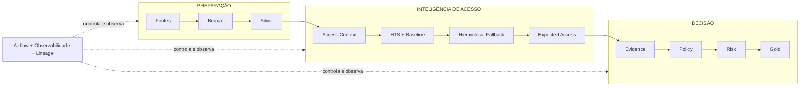

  
  Access Governance · Data Engineering · Information Security

# SoD Platform

Uma POC executável para transformar acessos dispersos em **decisões explicáveis, priorizadas e auditáveis**, resolvendo a sanitização top-down da Fase 1 sem fechar o caminho para a SoD transacional da Fase 2.

<a href="negocio/problema-e-fases/" class="md-button md-button--primary">Entender o problema</a>
<a href="arquitetura/arquitetura-v2/" class="md-button sod-secondary">Ver arquitetura V2</a>

  
<b>Fase 1</b>sanitização e governança de acesso

  
<b>4 decisões</b>PADRÃO · LEGÍTIMO · INDEVIDO · REVISÃO

  
<b>Runtime V2</b>Airflow + Spark + Iceberg

  
<b>Fase 2</b>evolução para SoD transacional

!!! tip "Não conhece IAM ou os termos técnicos?"
    A documentação foi escrita para começar pela linguagem de negócio. Consulte o [Vocabulário essencial](negocio/vocabulario.md) para entender termos como grant, birthright, cross-community, baseline, Hierarchical Fallback, âncora, Policy e Risk.

## O problema em uma frase

Hoje, descobrir se um acesso é realmente inadequado pode exigir entrevistas, conhecimento distribuído e análise manual. O desafio é transformar esse processo em uma decisão baseada em dados **sem confundir comportamento frequente com autorização**.

**A proposta:** contextualizar o acesso → estimar comportamento esperado → organizar evidências → aplicar política explícita → calcular risco → publicar uma fila acionável.

## Duas fases, uma única fundação

<strong>Visão da evolução:</strong> a Fase 1 usa fundamentos de Segurança da Informação — baseline, least privilege, need-to-know, evidência e auditabilidade — para governar acessos atuais. A Fase 2 reutiliza essa fundação e acrescenta semântica transacional, ML/Graph e LLM + RAG para descobrir e interpretar conflitos SoD sem transferir a decisão final para a IA.

A solução foi desenhada para resolver o problema imediato sem criar uma arquitetura descartável.

  

    Fase 1 · implementada
    <h3>Access Governance</h3>
    
Contextualizar acessos, estabelecer baseline, organizar evidências, classificar e priorizar.

  

  

    <strong>Fundação reutilizável</strong>
    Evidence · Policy · Risk · Gold · Airflow · Observabilidade
  

  

    Fase 2 · evolução
    <h3>SoD Transacional + IA assistida</h3>
    
Transaction Context + ML/Graph + LLM/RAG + catálogo SoD + Conflict Engine.

  

!!! important "Escopo correto"
    A POC implementa a **Fase 1**. Ela não chama a sanitização top-down de “SoD plena”. A **Fase 2** é uma arquitetura evolutiva que reutiliza contexto, evidência, política, risco, lineage, observabilidade e operação.

## A arquitetura em uma visão

A arquitetura separa **preparação**, **inteligência de acesso** e **decisão**. Airflow e observabilidade atravessam o fluxo inteiro para garantir ordem, qualidade, versões, snapshots e reconciliação.

## O que está implementado

  
Implementado<h3>Pipeline de dados</h3>
Bronze e Silver com contratos, qualidade, quarentena e persistência Iceberg.

  
Implementado<h3>Entendimento do acesso</h3>
Contexto, referências explícitas confiáveis, padrão observado e comparação por pares. Na parte técnica: Access Context, HTS, Baseline, Fallback e Expected Access.

  
Implementado<h3>Decisão e prioridade</h3>
Fatos são organizados, regras classificam e o risco define o que tratar primeiro. Tecnicamente: Evidence → Policy → Risk → Gold.

  
Operação<h3>Airflow</h3>
DAG V2 com gates, dependências, retries, registro de execução e validação offline separada.

  
Controle<h3>Observabilidade</h3>
Contagens, DQ, quarentena, journal de componentes, snapshots, lineage, versões e reconciliação.

  
Consumo<h3>Streamlit</h3>
Visões executiva, operacional, explicabilidade, validação e saúde do pipeline.

## Três princípios que evitam decisões perigosas

### 1. Frequência não é autorização

Se 90% de um grupo possui determinado entitlement, isso prova que o acesso é **comum**, não que ele seja **permitido**. Por isso Expected Access é anterior à Policy.

### 2. Ausência de evidência não é automaticamente irregularidade

Se não existe registro de uso, mas a cobertura da telemetria é desconhecida, a conclusão correta é **“sem uso registrado”**, e não “nunca utilizado”. Se uma autorização não pode ser ligada com confiança ao grant, a incerteza é preservada.

### 3. Classificação não é prioridade

Policy responde **o que o acesso é**. Risk responde **o que tratar primeiro**. Um acesso pode ser legítimo e ainda assim possuir alto impacto. Alto impacto não reclassifica automaticamente um acesso legítimo como indevido.

## Como ler

  
01 · Negócio<h3>Comece pelo problema</h3>
Entenda as duas fases, as regras explícitas do case, as hipóteses da POC e os nove desafios antes de entrar em componentes.

  
02 · Arquitetura<h3>Veja como a solução evoluiu</h3>
A arquitetura inicial já nasce com baseline, análise por grupos, detecção de desvios, regras e observabilidade; a V2 formaliza essas ideias em contratos independentes e auditáveis.

  
03 · Técnica<h3>Entre nos contratos</h3>
Grain, inputs, outputs, baseline, regras, score, gates, observabilidade, testes e operação são explicados com exemplos.

  
04 · Decisões<h3>Entenda trade-offs</h3>
Experimentos shadow, limitações, premissas de produção e o papel da IA são tratados sem esconder incertezas.

## Estado da solução

| Elemento | Estado | Papel |
|---|---|---|
| Bronze / Silver | IMPLEMENTADO | ingestão, contrato e qualidade |
| Access Context / HTS / Baseline / EA | IMPLEMENTADO | inteligência de acesso |
| Evidence / Policy / Risk / Gold | IMPLEMENTADO | decisão e priorização |
| Airflow runtime + validation | IMPLEMENTADO | controle operacional |
| Observabilidade + dashboard | IMPLEMENTADO | saúde, auditoria e consumo |
| Peer Discovery / clustering / grafos | SHADOW | experimentação |
| Matriz SoD transacional | FASE 2 | estado futuro |
| AWS | ARQUITETURA-ALVO | produção cloud |

A documentação foi escrita para permitir que a solução seja questionada. Onde existe uma premissa de POC, ela é declarada; onde existe uma limitação, ela não é escondida.
