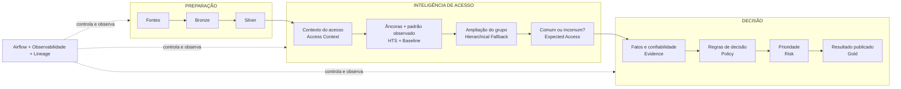

  
  Access Governance · Data Engineering · Information Security

# SoD Platform

Esta solução analisa os acessos que pessoas possuem aos sistemas de uma organização e ajuda a separar **acessos normais, exceções justificadas, possíveis irregularidades e casos que precisam de revisão**.

Tecnicamente, é uma **prova de conceito (POC)** de Governança de Acessos que implementa a Fase 1 e prepara a evolução para **Segregation of Duties (SoD)** transacional.

<a href="negocio/problema-e-fases/" class="md-button md-button--primary">Entender o problema</a>
<a href="arquitetura/arquitetura-v2/" class="md-button sod-secondary">Ver arquitetura</a>
<a href="https://github.com/Lal3x/SoD-Plataform" class="md-button sod-secondary" target="_blank" rel="noopener">Ver repositório</a>

  
<b>Fase 1</b>limpeza e governança de acessos

  
<b>4 decisões</b>PADRÃO · LEGÍTIMO · INDEVIDO · REVISÃO

  
<b>Arquitetura atual</b>Airflow + Spark + Iceberg

  
<b>Fase 2</b>evolução para SoD transacional

!!! tip "Não conhece IAM ou os termos técnicos?"
    A documentação foi escrita para começar pela linguagem de negócio. Consulte o [Vocabulário essencial](negocio/vocabulario.md) para entender termos como grant, birthright, cross-community, baseline, Hierarchical Fallback, âncora, Policy e Risk.

## O problema em uma frase

Hoje, descobrir se um acesso é realmente inadequado pode exigir entrevistas, conhecimento distribuído e análise manual. O desafio é transformar esse processo em uma decisão baseada em dados **sem confundir comportamento frequente com autorização**.

!!! info "O que significa SoD?"
    **SoD (Segregation of Duties / Segregação de Funções)** é o princípio de evitar que uma mesma pessoa acumule capacidades incompatíveis. Exemplo: quem **cria um pagamento** não deveria, sem controles adequados, também **aprovar o mesmo pagamento**.

    A Fase 1 ainda não executa a SoD transacional completa. Ela limpa, contextualiza e governa os acessos para que a Fase 2 consiga analisar conflitos com uma base confiável.

**A proposta:** contextualizar o acesso → estimar comportamento esperado → organizar evidências → aplicar política explícita → calcular risco → publicar uma fila acionável.

## Duas fases, uma única fundação

<strong>Visão da evolução:</strong> a Fase 1 usa fundamentos de Segurança da Informação — padrão de comportamento (baseline), menor privilégio, necessidade de acesso, evidência e auditabilidade — para governar acessos atuais. A Fase 2 reutiliza essa fundação e acrescenta semântica transacional, ML/Graph e LLM + RAG para descobrir e interpretar conflitos SoD sem transferir a decisão final para a IA.

A solução foi desenhada para resolver o problema imediato sem criar uma arquitetura descartável.

  

    Fase 1 · implementada
    <h3>Access Governance</h3>
    
Contextualizar acessos, estabelecer baseline, organizar evidências, classificar e priorizar.

  

  

    <strong>Fundação reutilizável</strong>
    Evidence · Policy · Risk · Gold · Airflow · Observabilidade
  

  

    Fase 2 · evolução
    <h3>SoD Transacional + IA assistida</h3>
    
Transaction Context + ML/Graph + LLM/RAG + catálogo SoD + Conflict Engine.

  

!!! important "Escopo correto"
    A POC implementa a **Fase 1**. Ela não chama essa limpeza e governança top-down de “SoD plena”. A **Fase 2** é uma arquitetura evolutiva que reutiliza contexto, evidência, política, risco, lineage, observabilidade e operação.

## A arquitetura em uma visão

A arquitetura separa **preparação**, **inteligência de acesso** e **decisão**. Airflow e observabilidade atravessam o fluxo inteiro para garantir ordem, qualidade, versões, snapshots e reconciliação.

## A stack em linguagem simples

| Tecnologia | Papel na solução |
|---|---|
| **Spark / PySpark** | processa e transforma grandes volumes de dados |
| **Iceberg** | armazena tabelas com snapshots/versionamento para rastreabilidade |
| **Airflow** | garante a ordem de execução e as dependências entre etapas |
| **Streamlit** | apresenta resultados, explicações e observabilidade |

Essas ferramentas executam a solução; **as regras de negócio e os princípios de Segurança da Informação continuam sendo a parte que define o significado da decisão**.

## O que está implementado

  
Implementado<h3>Pipeline de dados</h3>
Bronze e Silver com contratos, qualidade, quarentena e persistência Iceberg.

  
Implementado<h3>Entendimento do acesso</h3>
Contexto, referências explícitas confiáveis, padrão observado e comparação por pares. Na parte técnica: Access Context, HTS, Baseline, Fallback e Expected Access.

  
Implementado<h3>Decisão e prioridade</h3>
Fatos são organizados, regras classificam e o risco define o que tratar primeiro. Tecnicamente: Evidence → Policy → Risk → Gold.

  
Operação<h3>Airflow</h3>
DAG V2 com gates, dependências, retries, registro de execução e validação offline separada.

  
Controle<h3>Observabilidade</h3>
Contagens, DQ, quarentena, journal de componentes, snapshots, lineage, versões e reconciliação.

  
Consumo<h3>Streamlit</h3>
Visões executiva, operacional, explicabilidade, validação e saúde do pipeline.

## Três princípios que evitam decisões perigosas

### 1. Frequência não é autorização

Se 90% de um grupo possui determinado entitlement, isso prova que o acesso é **comum**, não que ele seja **permitido**. Por isso Expected Access é anterior à Policy.

### 2. Ausência de evidência não é automaticamente irregularidade

Se não existe registro de uso, mas a cobertura da telemetria é desconhecida, a conclusão correta é **“sem uso registrado”**, e não “nunca utilizado”. Se uma autorização não pode ser ligada com confiança ao grant, a incerteza é preservada.

### 3. Classificação não é prioridade

Policy responde **o que o acesso é**. Risk responde **o que tratar primeiro**. Um acesso pode ser legítimo e ainda assim possuir alto impacto. Alto impacto não reclassifica automaticamente um acesso legítimo como indevido.

## O que o run validado mostrou

A execução completa de referência processou **75.577 acessos canônicos** e só consultou o gabarito depois que as decisões já estavam produzidas.

| Resultado | Leitura simples |
|---|---|
| **94,64%** de acurácia exata | decisão exatamente igual ao gabarito |
| **95,86%** de acurácia nas decisões automatizadas | qualidade quando a solução decidiu sem mandar para revisão |
| **98,73%** de automação | quase todos os casos receberam PADRÃO, LEGÍTIMO ou INDEVIDO |
| **1,27%** de revisão | pequena parcela foi preservada para análise humana |
| **0 false-safe crítico** | nenhum indevido rotulado foi tratado como seguro |
| **0 false-indevido** | nenhum acesso válido rotulado foi classificado como indevido |

A interpretação completa — incluindo a principal oportunidade de calibração entre **PADRÃO e LEGÍTIMO** — está em **[Resultados da POC](resultados.md)**.

## Como ler esta documentação

A documentação foi organizada para responder perguntas em uma sequência lógica: **qual é o problema → quais princípios orientam a solução → como a arquitetura funciona → o que foi implementado → quais resultados apareceram → quais são os limites e próximos passos**.

| Perfil | Caminho recomendado |
|---|---|
| **Negócio / gestão** | Problema e duas fases → Regras de negócio → Resultados da POC |
| **Segurança / auditoria** | Fundamentos de Segurança → Anatomia de uma decisão → Premissas e gates de produção |
| **Engenharia de Dados** | Arquitetura V2 → Pipeline → Modelo de dados → Orquestração e observabilidade |
| **Avaliador técnico** | Arquitetura inicial → Evolução → Anatomia de uma decisão → Rastreabilidade técnica → Resultados |

!!! tip "Se você tiver apenas 10 minutos"
    Leia **O problema e as duas fases → Arquitetura V2 atual → Anatomia de uma decisão → Resultados da POC**. Esse percurso mostra problema, solução, funcionamento e resultado sem exigir leitura de todas as páginas.

### Sequência completa

1. **Negócio:** entenda o problema, as duas fases e as regras.
2. **Arquitetura:** veja de onde o desenho partiu e por que ele evoluiu.
3. **Técnica:** entre nos contratos, dados, algoritmos, decisões e operação.
4. **Resultados:** confira o que a implementação produziu no cenário sintético.
5. **Decisões:** revise trade-offs, premissas, experimentos e uso de IA.
6. **Referência:** use execução local e estrutura do repositório como material de consulta.

## Estado da solução

| Elemento | Estado | Papel |
|---|---|---|
| Bronze / Silver | IMPLEMENTADO | ingestão, contrato e qualidade |
| Access Context / HTS / Baseline / EA | IMPLEMENTADO | inteligência de acesso |
| Evidence / Policy / Risk / Gold | IMPLEMENTADO | decisão e priorização |
| Airflow runtime + validation | IMPLEMENTADO | controle operacional |
| Observabilidade + dashboard | IMPLEMENTADO | saúde, auditoria e consumo |
| Peer Discovery / clustering / grafos | SHADOW | experimentação |
| Matriz SoD transacional | FASE 2 | estado futuro |
| AWS | ARQUITETURA-ALVO | produção cloud |

A documentação foi escrita para permitir que a solução seja questionada. Onde existe uma premissa de POC, ela é declarada; onde existe uma limitação, ela não é escondida.
