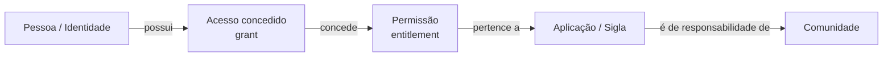

# O problema e as duas fases

## 1. O problema operacional antes da tecnologia

O desafio não começa em ferramentas ou algoritmos. Ele começa em uma pergunta operacional simples e difícil de responder em escala:

> **“Este acesso deveria estar com esta pessoa?”**

Em um processo predominantemente manual, responder essa pergunta pode exigir consultar diferentes áreas, gestores e sistemas até reconstruir o contexto.

~~~text
apontamento de acesso
        ↓
quem é a pessoa?
        ↓
qual é sua comunidade?
        ↓
quem é dono da sigla?
        ↓
o acesso é padrão?
        ↓
há aprovação?
        ↓
houve mudança de área?
        ↓
há evidência suficiente?
        ↓
decisão
~~~

Esse fluxo possui três problemas estruturais:

**Conhecimento distribuído.** A regra não está centralizada em uma única fonte.

**Escala.** Entrevistar todas as áreas não acompanha o volume de identidades, sistemas e grants.

**Ambiguidade.** Um acesso diferente pode ser indevido, mas também pode ser uma exceção legítima.

O case explicita que muitos apontamentos atuais são acessos que não pertencem aparentemente à estrutura da pessoa e que tratar esse conjunto é o primeiro passo, mas **ainda não representa SoD plena**.

## 2. Antes da arquitetura: o modelo mental dos dados

Para entender o restante da solução, basta guardar esta relação:



Exemplo simples:

```text
João trabalha na comunidade Crédito
        ↓
possui ENT_APROVAR_COBRANCA
        ↓
esse entitlement pertence ao sistema COB
        ↓
o sistema COB pertence à comunidade Cobrança
        ↓
o acesso atravessa a fronteira da comunidade
        ↓
isso exige contexto e evidência; não significa automaticamente irregularidade
```

A partir daí, a plataforma pergunta: o acesso é público? é nato? existe aprovação? é comum para pessoas comparáveis? há certificação? existe evidência suficiente para decidir?

!!! info "Por que o projeto se chama SoD Platform se a Fase 1 não é SoD completa?"
    Porque a **Fase 1 constrói a fundação governada** — dados padronizados, contexto, evidência, regras, risco, rastreabilidade (`lineage`) e observabilidade — que a **Fase 2 reutiliza para analisar conflitos SoD transacionais**. A ideia é resolver o problema imediato sem criar uma arquitetura descartável.

## 3. Fase 1 — reduzir o “mato alto”

A primeira fase é uma sanitização top-down por comunidade.

A lógica de negócio é:

~~~text
Comunidade
    │
    ├─ quais siglas pertencem a ela?
    ├─ quais acessos são recorrentes?
    ├─ quais exceções possuem autorização?
    ├─ quais acessos atravessam fronteiras?
    └─ quais casos não possuem evidência suficiente?
~~~

O resultado esperado pelo case é distinguir:

- **PADRÃO:** coerente com o funcionamento esperado do grupo;
- **LEGÍTIMO:** exceção válida, como uma autorização cross-community;
- **INDEVIDO:** acesso que viola uma regra sustentada por evidência.

A POC acrescenta **REVISÃO** como mecanismo de segurança: quando os dados não sustentam uma conclusão confiável, o sistema não força uma decisão binária.

### Unidade de análise e nível de detalhe da decisão

O case fala em unidade de análise **comunidade** e granularidade do acesso **Entitlement × Sigla**.

Para produzir uma decisão auditável, a implementação precisa representar cada caso em um nível mais detalhado:

> **um acesso específico de uma identidade × data de avaliação**

Em linguagem simples, **cada linha de decisão representa um acesso específico de uma pessoa em uma determinada data**. Isso permite explicar o caso individual e depois agregar os resultados por comunidade sem perder o detalhe.

## 4. O que torna a Fase 1 difícil

### Cross-community não é automaticamente indevido

Uma pessoa pode acessar uma sigla de outra comunidade por necessidade legítima. Portanto, cross-community é um **fato a explicar**, não uma sentença.

### Sigla pública rompe a fronteira organizacional

Se a aplicação é pública para o banco, pertencer a outra comunidade não é sinal suficiente de risco.

### Acesso raro pode ser legítimo

Um especialista pode precisar de um entitlement que quase ninguém possui.

### Acesso frequente pode continuar errado

Se um erro histórico foi replicado para muitas pessoas, ele pode se tornar “comum” sem se tornar “autorizado”. Essa observação é a razão para separar **Expected Access** de **Policy**.

### Comunidades pequenas não sustentam uma comparação simples

Se um grupo tem poucos membros, uma estatística local pode ser enganosa. Essa limitação levou ao Hierarchical Fallback.

## 5. Fase 2 — SoD transacional

Depois da sanitização, a pergunta fica mais profunda.

**SoD (Segregation of Duties / Segregação de Funções)** procura combinações de capacidades incompatíveis na mesma pessoa.

A Fase 1 pergunta:

> “Este acesso faz sentido neste contexto?”

A Fase 2 pergunta:

> “A combinação das capacidades acumuladas por esta identidade permite executar atividades conflitantes?”

Exemplo:

~~~text
IDENTIDADE
   │
   ├─ pode criar pagamento
   │
   └─ pode aprovar pagamento
             │
             ▼
      mesmo processo?
      mesmo escopo?
      mesma vigência?
             │
             ▼
     conflito SoD potencial
~~~

A análise futura precisa considerar função, transação, ação, objeto, escopo, vigência, exceção formal e controle compensatório.

## 6. Por que as fases pertencem à mesma arquitetura

Os componentes atuais já resolvem problemas que continuarão existindo na SoD transacional:

| Capacidade atual | Por que continua necessária |
|---|---|
| contexto da identidade | conflito depende de quem executa |
| temporalidade | conflito depende de vigência |
| evidência | exceções e controles precisam ser provados |
| política versionada | regra SoD muda ao longo do tempo |
| risco | conflitos possuem impactos diferentes |
| lineage | auditoria precisa reconstruir a decisão |
| observabilidade | dados e regras podem degradar |
| orquestração | ordem e consistência das etapas importam |

A Fase 2 adiciona **semântica transacional e catálogo de conflitos**, não substitui a fundação.

## 7. Resultado esperado da Fase 1

Ao final, o objetivo não é apenas gerar um arquivo com suspeitas. É produzir uma fila explicável:

~~~text
grant
  ↓
contexto
  ↓
evidências
  ↓
decisão + motivo
  ↓
risco + drivers
  ↓
ação:
  REMEDIATE
  REVIEW
  MONITOR
  NONE
~~~

Isso muda o trabalho humano: em vez de descobrir a regra do zero para cada acesso, o analista recebe uma decisão contextualizada e pode concentrar esforço em risco e incerteza.
