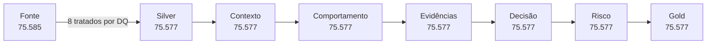

# Resultados da POC

Esta página responde, em linguagem direta, três perguntas:

1. **os dados chegaram ao final sem perda ou duplicação indevida?**
2. **a solução tomou decisões sem consultar o gabarito?**
3. **quando comparamos as decisões com a resposta esperada, qual foi o resultado?**

Os números abaixo vêm do **run validado de 30/09/2026**, executado sobre o cenário sintético V2. Eles demonstram o comportamento da POC nesse ambiente controlado e **não são uma estimativa de desempenho em produção**.

## O resultado em uma visão

| Pergunta | Resultado | Leitura simples |
|---|---:|---|
| registros de acesso recebidos | **75.585** | volume bruto recebido |
| acessos canônicos processados | **75.577** | 8 registros foram tratados por qualidade de dados |
| acessos com resposta esperada conhecida | **75.485** | população usada para medir acerto |
| taxa de acerto exata | **94,64%** | decisão exatamente igual ao gabarito |
| taxa de acerto das decisões automáticas | **95,86%** | acerto quando a solução decidiu sem mandar para revisão |
| casos decididos automaticamente | **98,73%** | PADRÃO, LEGÍTIMO ou INDEVIDO |
| casos enviados para revisão humana | **1,27%** | incerteza ou contradição preservada |
| indevidos tratados como seguros | **0** | zero *critical false-safe* |
| acessos válidos classificados como indevidos | **0** | zero *false-indevido* |

!!! success "A leitura mais importante"
    No cenário sintético validado, **nenhum acesso realmente INDEVIDO foi classificado como PADRÃO ou LEGÍTIMO e nenhum acesso PADRÃO/LEGÍTIMO foi classificado como INDEVIDO**.

    Isso não prova que o mesmo desempenho ocorrerá com dados reais. Prova que, no universo controlado usado para testar a POC, o mecanismo se comportou dessa forma.

## 1. Identificação do run

| Item | Valor |
|---|---|
| Run ID | `manual__2026-09-30T16:28:00` |
| Git SHA | `205bde89b06633d49403fea953d627bf0281aee8` |
| dataset | V2 |
| data de ingestão | `2025-02-01` |
| data de referência da avaliação | `2025-02-01` |
| Gold snapshot | `3052553428006043189` |
| Policy | `PD002/1.0.1` |
| Evidence | `EV001/1.3.1` |
| Expected Access | `EA001/1.0.0` |
| Risk | `RISK001/1.0.0` |
| Gold | `GOLD001/1.0.0` |

Neste run, a data de ingestão e a data de avaliação possuem o mesmo valor. Conceitualmente são datas diferentes; essa simplificação da POC é explicada em [Premissas, controles e gates de produção](decisoes/limitacoes.md).

## 2. O que aconteceu com os 75.585 registros recebidos?

A execução permitiu fechar a reconciliação da fonte até a população canônica:

```text
75.585 registros de acesso recebidos
    - 2 registros duplicados
    - 3 referências de identidade inválidas
    - 3 referências de entitlement inválidas
-------------------------------------------
75.577 acessos canônicos processados
```

Em outras palavras, **nenhum registro simplesmente “sumiu”**: os 8 registros retirados da população canônica possuem motivo de qualidade de dados conhecido.

| Controle de qualidade | Quantidade |
|---|---:|
| `DUPLICATE_RECORD` | **2** |
| `INVALID_IDENTITY_REFERENCE` | **3** |
| `INVALID_ENTITLEMENT_REFERENCE` | **3** |
| **Total retirado dos assignments** | **8** |

Um relatório auxiliar do gerador V2 registra **75.583** grants, número coerente com a retirada das 2 duplicatas. A reconciliação operacional que determina a população Silver é **75.585 − 2 − 3 − 3 = 75.577**.

!!! note "E o MISSING_APPROVAL_EVIDENCE?"
    A execução também encontrou **1 request** com `MISSING_APPROVAL_EVIDENCE`. Esse problema pertence à fonte de solicitações de acesso, não aos 75.585 assignments; por isso ele **não entra** na conta que leva a 75.577 grants.

## 3. Os 75.577 acessos chegaram ao final?

Sim. Depois da Silver, todos os principais estágios trabalharam com os mesmos **75.577 acessos distintos**.

| Etapa | Linhas | Acessos distintos |
|---|---:|---:|
| Silver | **75.577** | **75.577** |
| Access Context | **75.577** | **75.577** |
| Hard Trusted Set | **75.577** | **75.577** |
| Expected Access | **75.577** | **75.577** |
| Evidence Summary | **75.577** | **75.577** |
| Policy | **75.577** | **75.577** |
| Risk | **75.577** | **75.577** |
| Gold | **75.577** | **75.577** |

A Gold apresentou **zero divergências** em relação a Policy, Risk, Expected Access e Evidence.



## 4. O acesso parece comum ou incomum?

Antes de decidir se um acesso é permitido, a solução pergunta se ele parece comum para pessoas comparáveis.

| Resultado comportamental | Acessos | Participação |
|---|---:|---:|
| **EXPECTED** — parece esperado | **72.575** | **96,03%** |
| **UNEXPECTED** — parece incomum | **674** | **0,89%** |
| **INSUFFICIENT_EVIDENCE** — faltam elementos | **2.328** | **3,08%** |
| **Total** | **75.577** | **100%** |

Além disso, **12.886 acessos** foram reconhecidos como esperados por uma âncora explícita de *birthright*.

!!! info "Comum não significa autorizado"
    `EXPECTED` significa que o acesso parece coerente com uma referência conhecida ou com o comportamento do grupo. A autorização só é concluída depois, quando evidências e regras são avaliadas.

## 5. Que evidências foram encontradas?

A etapa de Evidence organiza fatos e registra a confiabilidade de cada um antes da decisão.

Entre os resultados:

- **2.670 acessos** tiveram uma aprovação associada por vínculo forte inferido (`STRONG_INFERRED`);
- a solução não transforma uma associação inferida em prova direta;
- certificação e aprovação permanecem fatos independentes;
- a parte que toma a decisão não lê o gabarito.

Foram materializados **1.889.425 fatos de evidência** para os 75.577 acessos.

## 6. O que as regras decidiram?

A Policy produziu quatro possíveis resultados:

| Decisão | Quantidade | Participação | Significado |
|---|---:|---:|---|
| **PADRÃO** | **71.703** | **94,87%** | acesso tratado como padrão pelas regras |
| **LEGÍTIMO** | **2.641** | **3,49%** | exceção sustentada por evidência |
| **INDEVIDO** | **273** | **0,36%** | condição suficiente para remediação |
| **REVISÃO** | **960** | **1,27%** | dados pedem análise humana |
| **Total** | **75.577** | **100%** | |

Há **273 decisões INDEVIDO no runtime**, mas o gabarito cobre 75.485 dos 75.577 casos. Entre os 273, **272 possuem resposta esperada conhecida** e aparecem na validação; o caso restante está entre os 92 sem rótulo.

## 7. A solução acertou?

Para responder isso, a solução primeiro termina e congela sua decisão. **Só depois** o Validation Mart consulta o gabarito.

```text
dados
  ↓
solução toma a decisão
  ↓
Gold é congelada
  ↓
só então o gabarito é consultado
  ↓
decisão é comparada com a resposta esperada
```

Isso evita que a solução “veja a resposta da prova antes de responder”. Tecnicamente, significa evitar **ground-truth leakage no runtime**.

### Resultado geral

Dos **75.485 acessos com gabarito**, a decisão foi exatamente igual à resposta esperada em **94,64%** dos casos.

Entre as decisões que a solução efetivamente automatizou — PADRÃO, LEGÍTIMO ou INDEVIDO — a taxa de acerto foi **95,86%**.

Ao mesmo tempo:

- **98,73%** dos 75.577 acessos receberam decisão automática;
- **1,27%** foram enviados para revisão humana.

!!! info "Por que existem duas taxas de acerto?"
    **94,64% de acurácia exata** pergunta: “a resposta final foi exatamente igual ao gabarito?”.

    **95,86% de acurácia automatizada** pergunta: “quando a solução decidiu automaticamente, sem usar REVISÃO, quantas decisões estavam corretas?”.

    Um caso enviado para REVISÃO não é considerado um acerto exato quando o gabarito possui uma classe final.

## 8. Onde a solução acertou e onde ainda pode melhorar?

A matriz abaixo mostra o que o gabarito dizia e o que a Policy respondeu.

| Resposta esperada | PADRÃO | LEGÍTIMO | INDEVIDO | REVISÃO | Total |
|---|---:|---:|---:|---:|---:|
| **PADRÃO** | **68.531** | 0 | 0 | 889 | **69.420** |
| **LEGÍTIMO** | 3.084 | **2.639** | 0 | 70 | **5.793** |
| **INDEVIDO** | 0 | 0 | **272** | 0 | **272** |

A principal oportunidade de calibração aparece na fronteira entre **PADRÃO e LEGÍTIMO**.

Dos 5.793 casos que o gabarito considera LEGÍTIMO:

```text
2.639 → LEGÍTIMO
3.084 → PADRÃO
   70 → REVISÃO
    0 → INDEVIDO
```

Por isso o **recall de LEGÍTIMO é 45,55%**. Isso não significa que 54,45% dos legítimos foram tratados como indevidos: **nenhum foi classificado como INDEVIDO**. A maior parte foi absorvida pela classe PADRÃO.

### Métricas por classe

| Classe | Precision | Recall | Leitura simples |
|---|---:|---:|---|
| **PADRÃO** | **95,69%** | **98,72%** | identifica quase todos os padrões, com alguma absorção de legítimos |
| **LEGÍTIMO** | **100%** | **45,55%** | quando chama de legítimo, acerta; ainda perde muitos legítimos para PADRÃO |
| **INDEVIDO** | **100%** | **100%** | encontrou todos os indevidos rotulados e não gerou falso indevido |

Para quem não conhece essas métricas:

- **precision** pergunta: “quando a solução usa esta classe, com que frequência ela está certa?”;
- **recall** pergunta: “de todos os casos que realmente pertencem a esta classe, quantos a solução conseguiu encontrar?”.

## 9. O que aconteceu com os casos mais sensíveis?

No cenário sintético validado:

- **0 critical false-safe:** nenhum INDEVIDO foi classificado como PADRÃO ou LEGÍTIMO;
- **0 false-indevido:** nenhum PADRÃO ou LEGÍTIMO foi classificado como INDEVIDO;
- **100% dos INDEVIDOS rotulados** foram encontrados;
- **100% dos INDEVIDOS rotulados** receberam faixa de risco CRITICAL;
- **100% dos cenários cross legítimos** tiveram a evidência de autorização esperada identificada;
- **99,97% dos cenários normais elegíveis** apresentaram prevalência de pelo menos 90%.

Esses números ajudam a entender o comportamento da POC, mas continuam sendo resultados de um **dataset sintético desenhado para testar cenários conhecidos**.

## 10. Risk priorizou sem alterar a decisão

Depois da Policy, o Risk adicionou prioridade operacional.

| Faixa de risco | Quantidade |
|---|---:|
| LOW | **4.166** |
| MEDIUM | **70.238** |
| HIGH | **900** |
| CRITICAL | **273** |

A verificação encontrou **zero divergências** entre a decisão da Policy antes e depois do Risk. Ou seja: impacto e urgência alteram a prioridade, não a classificação.

## 11. A implementação também foi testada depois do run

Depois da execução completa:

```text
pytest tests/access_intelligence tests/gold tests/observability -q
→ 75 passed
```

E a documentação foi validada com:

```text
mkdocs build --strict
→ passou
```

Isso não substitui validação de negócio, mas demonstra que o run validado também passou pelos controles automatizados diretamente relacionados ao caminho V2.

## 12. O que estes números provam — e o que não provam

### O que o run demonstra

- os 75.585 registros de acesso foram reconciliados até 75.577 grants canônicos;
- os mesmos 75.577 grants atravessaram os estágios principais sem perda ou duplicação;
- o gabarito ficou fora do caminho de decisão;
- a Policy, o Risk e a Gold permaneceram reconciliados;
- a validação mediu a qualidade sobre 75.485 casos rotulados;
- casos ambíguos puderam terminar em REVISÃO em vez de uma conclusão forçada.

### O que ainda precisa ser comprovado antes de produção

- precisão sobre dados reais do banco;
- cobertura real das fontes de aprovação e telemetria;
- calibração dos thresholds e pesos com amostras reais;
- desempenho, custo e SLA em escala produtiva;
- histórico temporal corporativo completo;
- regras institucionais formalmente aprovadas.

> **A POC demonstra método, arquitetura e comportamento controlado. Produção exige validação com dados e regras institucionais reais.**
