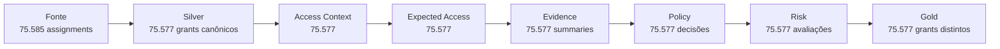
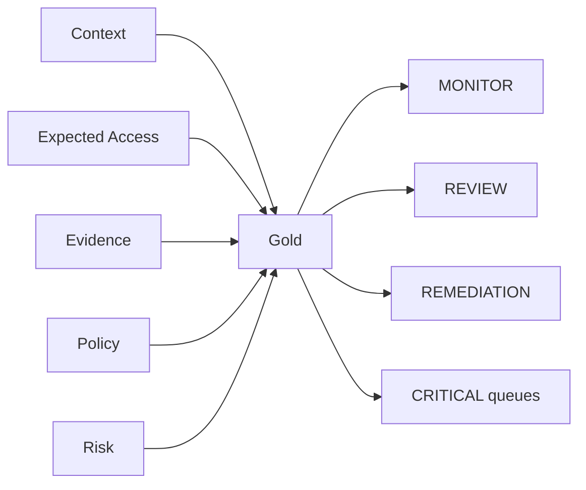

# Resultados da POC

Esta página mostra **o que a implementação V2 produziu no cenário sintético controlado**.

Os números abaixo servem para demonstrar comportamento do pipeline, cobertura dos contratos, capacidade de classificação, tratamento de incerteza e rastreabilidade. Eles **não devem ser interpretados como estimativa de performance em produção**, porque o case não fornece dados reais.

## Visão executiva

| Indicador | Resultado | O que demonstra |
|---|---:|---|
| identidades sintéticas | **9.932** | volume organizacional suficiente para testar grupos e contexto |
| entitlements | **1.906** | variedade de permissões e aplicações |
| grants recebidos na fonte | **75.585** | volume bruto do cenário |
| grants canônicos no runtime | **75.577** | população processada ponta a ponta após canonicalização/DQ |
| requests | **2.671** | evidências de autorização |
| certificações | **18.894** | sinais de revisão de acesso |
| grants com ground truth disponível | **75.485** | população rotulada para validação offline |
| grants sem rótulo | **92** | casos preservados sem forçar validação inexistente |

## 1. O pipeline preservou a população canônica ponta a ponta

Os estágios canônicos validam **75.577 grants distintos**, sem perda ou duplicação entre Context, Expected Access, Evidence, Policy, Risk e Gold.

A Gold também reconcilia seus componentes upstream e exige **zero divergências** entre os campos de Policy, Risk, Expected Access e Evidence.

## 2. Resultado do Expected Access

A implementação V2 produziu a seguinte distribuição comportamental:

| Resultado | Grants | Participação aproximada |
|---|---:|---:|
| **EXPECTED** | **72.575** | **96,03%** |
| **UNEXPECTED** | **674** | **0,89%** |
| **INSUFFICIENT_EVIDENCE** | **2.328** | **3,08%** |
| **Total** | **75.577** | **100%** |

Além disso, **12.886 grants** foram reconhecidos como esperados por **âncora explícita de birthright**. Esse valor é um subconjunto dos casos `EXPECTED`.

!!! info "Como interpretar"
    `EXPECTED` significa aderência a uma referência comportamental ou âncora explícita. Não significa automaticamente “autorizado”. A decisão de negócio continua em Evidence + Policy.

## 3. Evidência e autorização

A Evidence Layer mantém fatos e confiabilidade separados da decisão.

Entre os resultados materializados:

- **2.670 grants** possuem vínculo de aprovação classificado como `STRONG_INFERRED`;
- a Evidence não promove inferência para `DIRECT` ou `CONFIRMED` sem uma chave causal real;
- certificações e aprovação permanecem sinais independentes;
- o runtime não lê `ground_truth`, `scenario` ou `expected_class`.

Essa separação permite que a mesma evidência seja reavaliada por outra versão de Policy sem reconstruir todo o contexto.

## 4. Resultado da Policy

A Policy PD002/1.0.1 processa os **75.577 grants** com precedência explícita de regras.

Dois resultados merecem destaque:

| Resultado observado | Contagem | Interpretação |
|---|---:|---|
| `INDEVIDO` | **273** | casos classificados pela Policy como incompatíveis com as regras aplicáveis |
| `REVISÃO` com aprovação `STRONG_INFERRED` + certificação `REVOKE` | **29** | contradição preservada para revisão humana, em vez de decisão automática |

O segundo caso é particularmente importante: uma aprovação inferida não “vence” uma certificação de revogação. A arquitetura reconhece a contradição e interrompe a automação.

## 5. Risk não altera a classificação

O Risk Engine processa os mesmos **75.577 grants** e adiciona prioridade com base em fatores como:

- decisão da Policy;
- privilégio;
- criticidade da aplicação;
- escopo regulatório;
- classificação dos dados;
- evidências e sinais temporais.

O runtime verifica que o Risk **não altera `policy_decision` nem `policy_rule_id`**. Assim, impacto e urgência não contaminam a classificação original.

## 6. Gold como resultado operacional

A Gold materializa uma linha por grant com:

- contexto de identidade e acesso;
- Expected Access e força da evidência;
- aprovação e certificação;
- Policy e reason code;
- Risk, drivers e prioridade;
- versões e lineage;
- flags de revisão e remediação;
- fila operacional.

A Gold não cria regra nova; ela publica de forma reconciliada o que os estágios anteriores já decidiram.

## 7. Cobertura da validação offline

O Validation Mart é executado **depois da Gold congelada** e compara o runtime com o gabarito sintético.

| População | Quantidade |
|---|---:|
| grants avaliados | **75.577** |
| com ground truth | **75.485** |
| sem ground truth | **92** |

A validação materializa:

- matriz de confusão;
- precision, recall e F1 por classe;
- métricas por cenário;
- accuracy exata;
- accuracy das decisões automatizadas;
- automation rate;
- review rate;
- critical false-safe;
- false-indevido;
- cobertura de autorização cross legítimo.

!!! note "Por que não há uma accuracy fixa nesta página?"
    As métricas executivas são calculadas pelo Validation Mart para a execução congelada e consumidas pelo dashboard. O repositório versiona o método e os contratos, mas não mantém nesta página um número de accuracy desconectado de um run específico.

## 8. Cenários exercitados

O gerador sintético inclui situações desenhadas para testar decisões diferentes:

| Cenário | Volume gerado | Papel no teste |
|---|---:|---|
| normal | **59.500** | comportamento funcional recorrente |
| birthright | **9.920** | âncora explícita |
| entitlement público | **3.125** | fronteira pública |
| opcional aprovado | **2.465** | exceção interna autorizada |
| cross sem aprovação | **136** | violação de fronteira |
| cross legítimo | **135** | exceção cross autorizada |
| acesso herdado | **68** | temporalidade e mudança organizacional |
| contractor fora de escopo | **68** | contexto de identidade externa |
| tecnologia → negócio | **68** | acesso cross sensível |
| comunidade pequena | **9** | teste de suporte/fallback |

Alguns cenários funcionam como modificadores ou condições de teste; portanto, essa tabela representa cobertura do gerador e não deve ser lida como classes mutuamente exclusivas em todos os casos.

## 9. Controles técnicos demonstrados

A execução também comprova propriedades arquiteturais importantes:

- **zero ground-truth leakage** no runtime;
- uma linha canônica por `grant_id` nos principais estágios;
- snapshots e versões verificadas entre dependências;
- Policy separada de Risk;
- Gold reconciliada com upstream;
- Validation Mart isolado do runtime;
- casos ambíguos podem terminar em `REVISÃO` em vez de decisão forçada.

## 10. O que esses resultados demonstram

Os resultados sintéticos mostram que a implementação consegue:

1. processar dezenas de milhares de grants mantendo granularidade e rastreabilidade;
2. construir baseline e expectedness sem usar o gabarito;
3. separar comportamento observado de autorização;
4. preservar contradições e insuficiência de evidência;
5. aplicar regras versionadas de classificação;
6. priorizar risco sem modificar a decisão;
7. publicar uma Gold reconciliada e auditável;
8. avaliar a solução posteriormente em um Validation Mart isolado.

## 11. O que esses resultados ainda não provam

Eles não demonstram, por si só:

- precisão em dados reais do banco;
- cobertura real de requests e telemetria;
- SLA produtivo;
- custo em escala corporativa;
- estabilidade dos thresholds fora do cenário sintético.

Esses pontos são **gates de produção**, não falhas ocultas da POC.

> **O objetivo do cenário sintético é provar método, contratos e comportamento da arquitetura antes de expor a solução a dados produtivos.**
