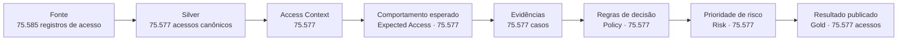
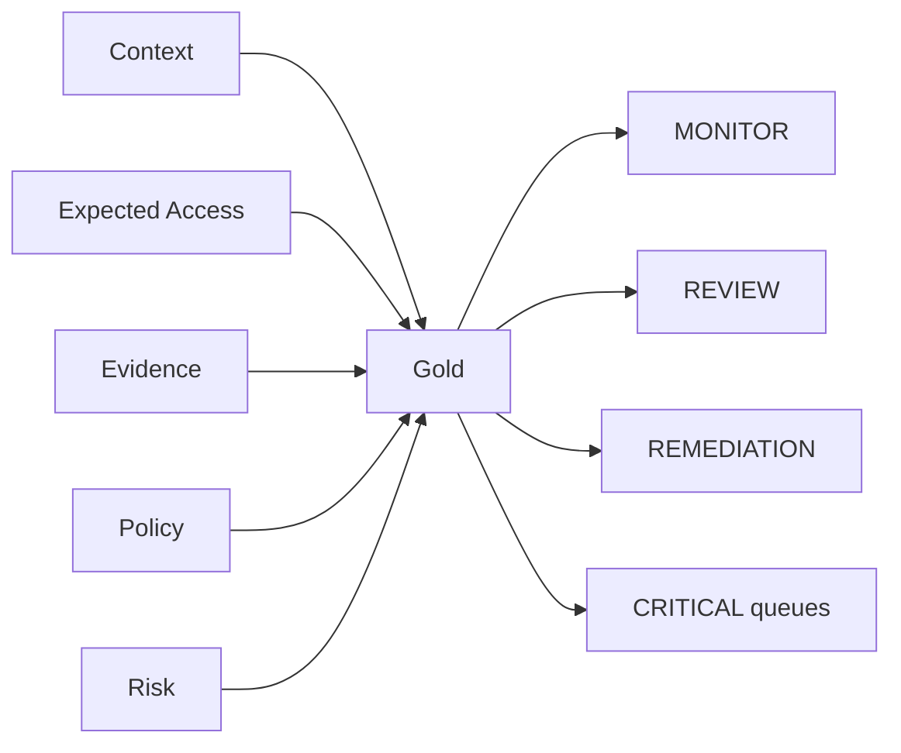

# Resultados da POC

Esta página mostra **o que a implementação V2 produziu no cenário sintético controlado**.

Os números abaixo mostram **o que a solução conseguiu processar, classificar, preservar e explicar** no cenário sintético. Eles **não devem ser interpretados como estimativa de desempenho em produção**, porque o case não fornece dados reais.

!!! tip "Como ler esta página"
    Primeiro veja **quantos acessos entraram e chegaram ao final sem perda ou duplicação**; depois observe **quais pareceram comuns ou incomuns**; em seguida, **quais decisões as regras produziram**; por fim, leia **o que esses números provam — e o que ainda não provam**.

## Visão executiva

| Indicador | Resultado | O que demonstra |
|---|---:|---|
| identidades sintéticas | **9.932** | volume organizacional suficiente para testar grupos e contexto |
| entitlements | **1.906** | variedade de permissões e aplicações |
| grants recebidos na fonte | **75.585** | volume bruto do cenário |
| acessos canônicos (`grants`) processados | **75.577** | população final após padronização e controles de qualidade |
| requests | **2.671** | evidências de autorização |
| certificações | **18.894** | sinais de revisão de acesso |
| acessos com gabarito (`ground truth`) disponível | **75.485** | casos cuja resposta esperada é conhecida para avaliação posterior |
| acessos sem resposta esperada | **92** | casos preservados sem inventar um gabarito que não existe |

!!! note "Por que aparecem três contagens diferentes?"
    O arquivo de origem contém **75.585 registros de acesso**. Um relatório auxiliar do gerador V2 registra **75.583**. Depois da padronização e dos controles de qualidade, a população usada pela solução é de **75.577 acessos canônicos (`grants`)**.

    A documentação não inventa uma causa registro a registro para essas diferenças intermediárias. O importante é que a passagem **dados recebidos → dados padronizados** seja explicável. Em produção, qualquer diferença precisa estar justificada por qualidade de dados (`DQ`), duplicidade, integridade ou outra transformação conhecida.

## 1. Os acessos foram preservados ponta a ponta

Depois da padronização, os principais estágios trabalham com os mesmos **75.577 acessos distintos**, sem perda ou duplicação entre contexto, análise comportamental, evidências, regras, risco e publicação.

A camada final (`Gold`) confere se o que foi publicado é exatamente o que as etapas anteriores produziram e exige **zero divergências** entre comportamento esperado, evidências, decisão e risco.

## 2. O acesso parece comum ou incomum? (Expected Access)

A análise de comportamento produziu a seguinte distribuição:

| Resultado | Grants | Participação aproximada |
|---|---:|---:|
| **EXPECTED** | **72.575** | **96,03%** |
| **UNEXPECTED** | **674** | **0,89%** |
| **INSUFFICIENT_EVIDENCE** | **2.328** | **3,08%** |
| **Total** | **75.577** | **100%** |

Além disso, **12.886 grants** foram reconhecidos como esperados por **âncora explícita de birthright**. Esse valor é um subconjunto dos casos `EXPECTED`.

!!! info "Como interpretar"
    `EXPECTED` significa que o acesso parece coerente com uma referência conhecida ou com o comportamento do grupo. **Isso não significa automaticamente que ele esteja autorizado.** A autorização só é concluída depois de analisar evidências e aplicar as regras de decisão.

## 3. Que evidências existem para justificar o acesso?

A etapa de evidências (`Evidence`) organiza os fatos disponíveis e registra quão confiável é cada um, sem decidir sozinha se o acesso é correto ou incorreto.

Entre os resultados materializados:

- **2.670 acessos** possuem uma aprovação associada com vínculo forte inferido (`STRONG_INFERRED`);
- uma associação inferida não é apresentada como prova direta (`DIRECT` ou `CONFIRMED`) sem uma chave causal real;
- certificações e aprovação permanecem sinais independentes;
- a parte que toma a decisão não lê o gabarito nem campos que revelam a resposta esperada.

Isso permite reaplicar novas versões das regras sobre os mesmos fatos sem reconstruir todo o contexto do acesso.

## 4. O que as regras decidiram? (Policy)

O conjunto versionado de regras (`Policy PD002/1.0.1`) avalia os **75.577 acessos** em uma ordem explícita, para que a mesma combinação de fatos sempre produza a mesma decisão.

Dois resultados merecem destaque:

| Resultado observado | Contagem | Interpretação |
|---|---:|---|
| `INDEVIDO` | **273** | casos em que as regras encontraram uma condição suficiente para classificar o acesso como inadequado |
| `REVISÃO` com aprovação inferida forte + certificação `REVOKE` | **29** | havia sinais conflitantes; a solução preferiu encaminhar para análise humana em vez de decidir automaticamente |

O segundo caso é particularmente importante: uma aprovação inferida não “vence” uma certificação de revogação. A arquitetura reconhece a contradição e interrompe a automação.

## 5. Depois de decidir, a solução define a prioridade (Risk)

A etapa de priorização (`Risk`) recebe os mesmos **75.577 acessos** e calcula quais casos merecem atenção primeiro com base em fatores como:

- decisão da Policy;
- privilégio;
- criticidade da aplicação;
- escopo regulatório;
- classificação dos dados;
- evidências e sinais temporais.

A implementação verifica que a prioridade de risco **não pode mudar a decisão já tomada pelas regras**. Assim, um caso sensível pode subir na fila sem ser reclassificado artificialmente.

## 6. O resultado final publicado (Gold)

A camada final (`Gold`) publica uma linha por acesso contendo:

- contexto de identidade e acesso;
- Expected Access e força da evidência;
- aprovação e certificação;
- decisão das regras e motivo da decisão (`reason code`);
- prioridade de risco e fatores que contribuíram para ela;
- versões e rastreabilidade (`lineage`);
- indicadores de revisão e remediação;
- fila operacional.

A Gold não toma uma nova decisão. Ela apenas reúne e publica, de forma consistente, o que as etapas anteriores já concluíram.

## 7. A pergunta mais direta: a solução acertou?

A POC **sabe medir essa resposta**, mas o repositório não guarda na `main` um resultado final de validação associado a uma execução específica.

Por isso, esta documentação **não publica uma taxa de acerto (`accuracy`) sem conseguir apontar exatamente de qual execução ela veio**.

Quando a validação é executada sobre um resultado final já congelado, o dashboard mostra:

- accuracy exata;
- accuracy das decisões automatizadas;
- precision, recall e F1 por classe;
- taxa de automação;
- taxa de revisão;
- false-safe crítico;
- false-indevido;
- matriz de confusão;
- métricas por cenário.

!!! success "O que já podemos afirmar com evidência versionada"
    A solução preserva **75.577 acessos** nos estágios críticos, **toma suas decisões sem consultar o gabarito usado para avaliá-la**, envia casos incertos ou contraditórios para `REVISÃO` e possui o mecanismo necessário para medir qualidade depois. Tecnicamente, manter o gabarito fora da decisão significa evitar **ground-truth leakage no runtime**.

Para apresentar uma taxa de acerto formalmente, o correto é executar a validação, identificar e congelar aquela execução e guardar o conjunto de métricas correspondente.

## 8. Como a solução é avaliada depois da decisão

A avaliação (`Validation Mart`) acontece **somente depois que o resultado final está congelado**. Nesse momento, e só nesse momento, as decisões são comparadas com o gabarito sintético.

| População | Quantidade |
|---|---:|
| acessos avaliados | **75.577** |
| com resposta esperada conhecida | **75.485** |
| sem resposta esperada | **92** |

A validação materializa:

- matriz de confusão;
- precision, recall e F1 por classe;
- métricas por cenário;
- accuracy exata;
- accuracy das decisões automatizadas;
- automation rate;
- review rate;
- critical false-safe;
- false-indevido;
- cobertura de autorização cross legítimo.

!!! note "Por que não há uma taxa de acerto fixa nesta página?"
    A taxa de acerto (`accuracy`) é calculada para cada execução validada. O repositório guarda o método de cálculo, mas não publica aqui um número sem associá-lo a uma execução específica.

## 9. Cenários exercitados

O gerador sintético inclui situações desenhadas para testar decisões diferentes:

| Cenário | Volume gerado | Papel no teste |
|---|---:|---|
| normal | **59.500** | comportamento funcional recorrente |
| birthright | **9.920** | âncora explícita |
| entitlement público | **3.125** | fronteira pública |
| opcional aprovado | **2.465** | exceção interna autorizada |
| cross sem aprovação | **136** | violação de fronteira |
| cross legítimo | **135** | exceção cross autorizada |
| acesso herdado | **68** | temporalidade e mudança organizacional |
| contractor fora de escopo | **68** | contexto de identidade externa |
| tecnologia → negócio | **68** | acesso cross sensível |
| comunidade pequena | **9** | teste de suporte/fallback |

Alguns cenários funcionam como modificadores ou condições de teste; portanto, essa tabela representa cobertura do gerador e não deve ser lida como classes mutuamente exclusivas em todos os casos.

## 10. Controles que a implementação demonstrou

A execução também comprova propriedades arquiteturais importantes:

- **a solução toma suas decisões sem consultar o gabarito usado para avaliá-la** — tecnicamente, zero `ground-truth leakage` no runtime;
- cada acesso canônico possui uma única linha por `grant_id` nos principais estágios;
- versões e estados dos dados (`snapshots`) são verificados entre etapas;
- a regra que classifica o acesso (`Policy`) fica separada da etapa que define prioridade (`Risk`);
- o resultado final (`Gold`) é conferido contra as etapas que o produziram;
- a avaliação posterior (`Validation Mart`) fica isolada da parte que toma a decisão;
- casos ambíguos podem terminar em `REVISÃO` em vez de decisão forçada.

## 11. O que esses resultados demonstram

Os resultados sintéticos mostram que a implementação consegue:

1. processar dezenas de milhares de acessos mantendo o detalhe individual e a rastreabilidade;
2. estimar o comportamento esperado (`baseline` / `expectedness`) sem consultar o gabarito;
3. separar comportamento observado de autorização;
4. preservar contradições e insuficiência de evidência;
5. aplicar regras versionadas e reproduzíveis de classificação;
6. priorizar risco sem modificar a decisão;
7. publicar um resultado final (`Gold`) conferido e auditável;
8. avaliar a solução posteriormente em uma camada de validação isolada (`Validation Mart`).

## 12. O que esses resultados ainda não provam

Eles não demonstram, por si só:

- precisão em dados reais do banco;
- cobertura real de requests e telemetria;
- SLA produtivo;
- custo em escala corporativa;
- estabilidade dos limites numéricos (`thresholds`) fora do cenário sintético.

Esses pontos são **condições que precisam ser atendidas antes de produção** (`gates de produção`), não falhas ocultas da POC.

> **O objetivo do cenário sintético é provar método, contratos e comportamento da arquitetura antes de expor a solução a dados produtivos.**
