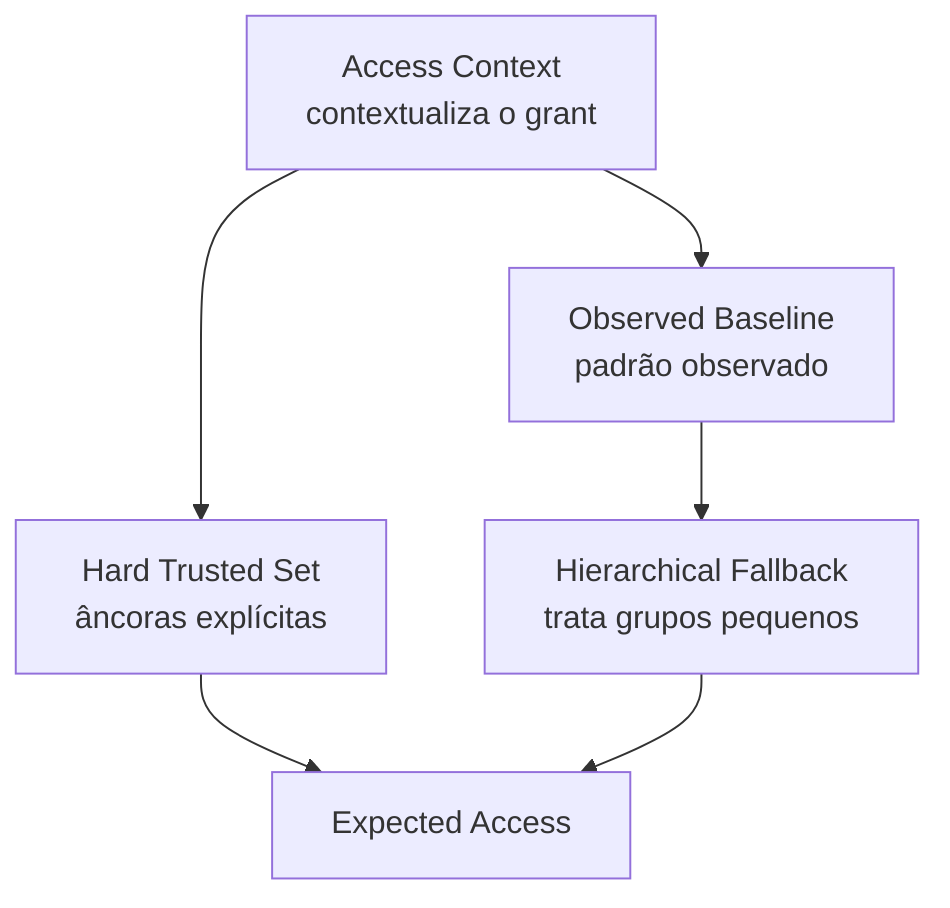

# Access Intelligence

## 1. O problema que esta camada resolve

Bronze e Silver conseguem responder “quais dados recebemos?” e “qual é a representação canônica?”. Elas ainda não respondem:

> “Este grant é coerente com o contexto da identidade?”

Access Intelligence existe para construir **contexto e evidência comportamental** sem misturar essa análise com autorização.

!!! tip "Em linguagem de negócio"
    Esta camada não responde **“o acesso é permitido?”**. Ela responde perguntas anteriores: **quem possui o acesso? em qual contexto? existe alguma referência explícita confiável? esse acesso é comum entre pessoas comparáveis? há dados suficientes para afirmar isso?**

| Pergunta de negócio | Nome técnico no projeto |
|---|---|
| qual é o contexto deste acesso? | Access Context |
| existe uma referência explícita forte? | Hard Trusted Set (HTS) |
| o que é comum para pessoas comparáveis? | Observed Baseline |
| o grupo é pequeno demais? | Hierarchical Fallback |
| o acesso parece esperado ou inesperado? | Expected Access |

## 2. Access Context — dar significado ao grant

Considere um registro simples:

~~~text
identidade_id = I-1023
entitlement_id = E-451
sigla_id = COB
~~~

Sozinho, ele não permite decidir nada.

A mesma linha precisa ser enriquecida com perguntas de contexto:

- qual comunidade da identidade?
- quem é dono da sigla?
- a sigla é pública?
- o entitlement é birthright?
- existe request aprovada?
- quando a concessão ocorreu?
- a pessoa já estava na comunidade atual?
- existe certificação?
- aplicação é crítica?
- entitlement é privilegiado?

Por isso Access Context cria uma visão factual por grant/data.

Entre os campos derivados estão:

- cross_community;
- approval_exists;
- approval_relevance;
- approval_linkage_quality;
- inherited_access_candidate;
- no_usage_recorded;
- usage_coverage;
- identity_history_complete;
- application_criticality;
- entitlement_privileged;
- source_snapshot_id;
- access_age_days;
- days_since_last_use.

A palavra importante é **factual**. Access Context não classifica.

## 3. Hard Trusted Set — âncoras explícitas

O problema do baseline puramente observado é simples: um erro repetido por muitas pessoas pode virar “normal”.

O Hard Trusted Set cria um conjunto de âncoras explícitas cuja confiança não depende da frequência.

Na V2, a principal âncora é birthright sem contradição relevante.

~~~text
birthright válido
      ↓
hard_trusted_flag = true
      ↓
Expected Access recebe
uma evidência explícita HIGH
~~~

### Por que HTS não é o próprio baseline?

Essa é uma decisão importante da V2.

Usar apenas âncoras HTS tornaria a população muito restrita para observar comportamento funcional em vários grupos. Por isso:

- HTS é usado como **âncora explícita**;
- Observed Baseline usa uma população observável filtrada mais ampla.

Consequência: ganha-se cobertura, mas permanece risco residual de contaminação do baseline. A arquitetura mitiga esse risco não deixando Expected Access decidir autorização sozinho.

## 4. Observed Baseline — medir prevalência

Observed Baseline responde:

> “Com que frequência este entitlement aparece em uma população comparável?”

A população atual exige identidade ativa, sem DQ bloqueante, same-community e concessão temporalmente válida.

Para cada população e entitlement, calculamos:

~~~text
population_size = número de identidades comparáveis
support_count   = quantas possuem o entitlement
prevalence      = support_count / population_size
~~~

### Exemplo

~~~text
grupo: Crédito + squad Alfa + Analista + employee

population_size = 20
support_count = 18

prevalence = 18 / 20 = 0.90
~~~

Isso é forte evidência de comportamento esperado.

Mas ainda não é autorização.

## 5. Hierarchical Fallback — lidar com grupo pequeno

Imagine:

~~~text
Crédito + Squad Alfa + Especialista + contractor
population_size = 1
~~~

Uma pessoa não é referência suficiente para si mesma.

O fallback tenta populações progressivamente mais amplas:

~~~text
1. comunidade + squad + cargo + tipo_identidade
2. comunidade + cargo
3. comunidade
4. tipo_identidade
~~~

Cada tentativa preserva um motivo:

- dimensões ausentes;
- baseline inexistente;
- suporte insuficiente;
- suficiente.

Se nenhum nível é defensável, o resultado é INSUFFICIENT_EVIDENCE.

### Por que isso é melhor do que “usar o banco inteiro”?

Porque expandir diretamente para toda a organização pode comparar populações sem relação funcional. O fallback tenta manter contexto enquanto aumenta a capacidade estatística.

## 6. Thresholds da POC

A configuração atual usa:

~~~text
prevalence >= 0.80 → EXPECTED
prevalence <= 0.20 → UNEXPECTED
entre 0.20 e 0.80 → INSUFFICIENT_EVIDENCE
~~~

Esses valores são parâmetros técnicos iniciais.

Eles **não foram calibrados pelo gabarito** e não devem ser tratados como regra institucional.

Da mesma forma, os mínimos de população e suporte atuais são adequados para demonstrar funcionamento da POC, mas são permissivos demais para serem assumidos como thresholds produtivos sem calibração.

## 7. Força da evidência

Nem todo fallback possui a mesma força.

A arquitetura diferencia a especificidade do baseline. O nível mais contextual pode sustentar evidência mais forte; populações mais amplas carregam força menor.

Isso cria uma diferença importante:

~~~text
fallback encontrou um padrão
        ≠
Policy obrigatoriamente classifica PADRÃO
~~~

R060 exige evidência HIGH para transformar padrão observado em decisão PADRÃO.

## 8. Expected Access

Expected Access combina duas famílias de evidência:

### Âncora explícita

~~~text
hard_trusted_flag = true
        ↓
EXPECTED
reason = EXPECTED_EXPLICIT_BIRTHRIGHT
strength = HIGH
~~~

### Padrão observado

~~~text
baseline suficiente
+
prevalence
        ↓
EXPECTED / UNEXPECTED / INSUFFICIENT_EVIDENCE
~~~

## 9. O que Expected Access não faz

Expected Access não decide:

- autorização;
- legitimidade;
- violação de política;
- risco;
- prioridade;
- remediação.

Essa fronteira evita transformar “estatisticamente diferente” em “indevido”.

## 10. Peer Discovery

O repositório contém experimentos de LDA + FP-Growth, NMF-HDBSCAN e MinHash/Jaccard + Leiden.

Eles estão em shadow mode e não alimentam o runtime V2.

O objetivo é testar se pares descobertos por comportamento podem, no futuro, melhorar a referência de comparação sem sacrificar explicabilidade e estabilidade.
