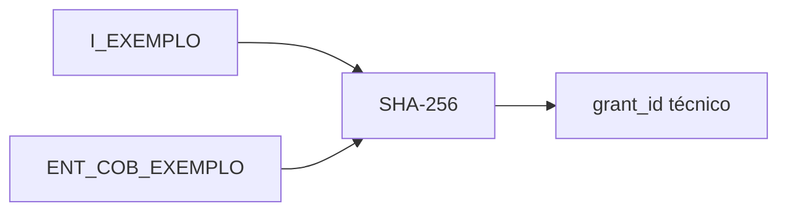
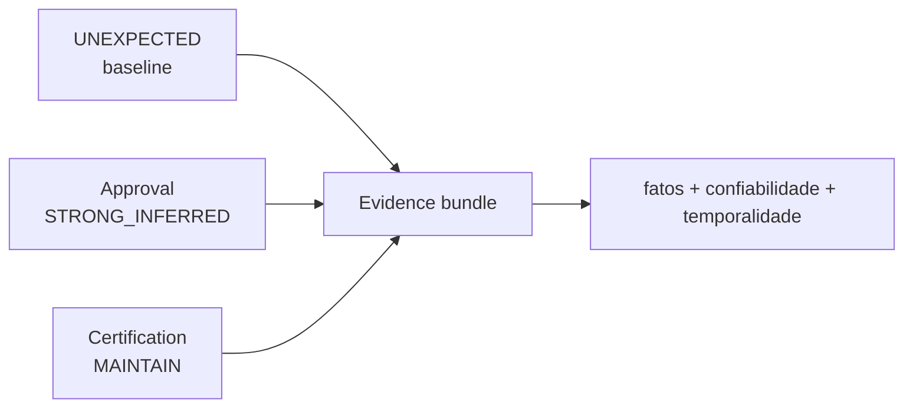
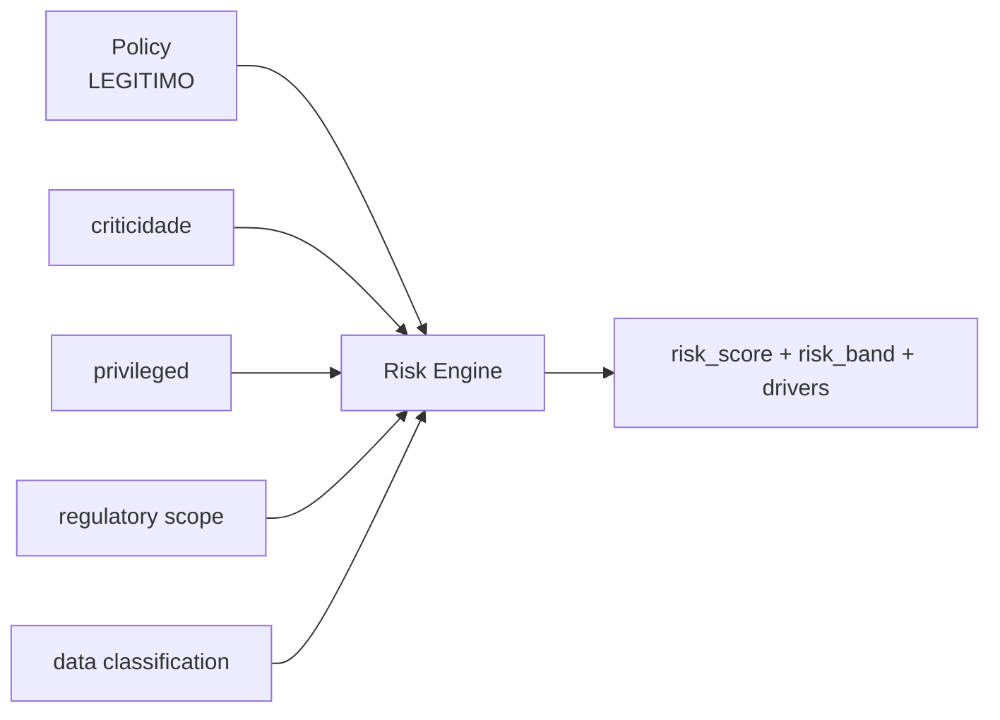
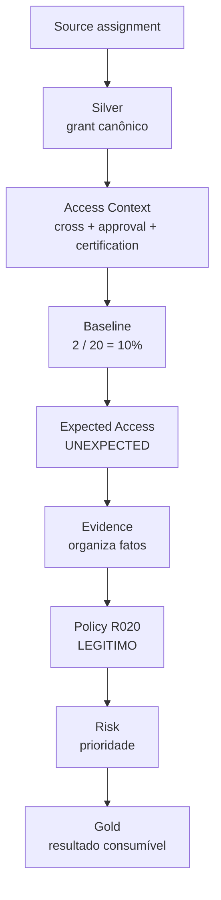

# Anatomia de uma decisão

Esta página acompanha **um acesso hipotético** através da arquitetura para mostrar como cada camada contribui para a decisão.

!!! warning "Exemplo didático"
    Os valores abaixo foram construídos para ilustrar as **regras reais implementadas**. Eles não representam uma linha específica do dataset sintético nem uma pessoa real.

## 1. Situação de negócio

Uma identidade da comunidade **Crédito** possui um entitlement pertencente à comunidade **Cobrança**.

| Atributo | Valor do exemplo |
|---|---|
| identidade | `I_EXEMPLO` |
| comunidade | Crédito |
| entitlement | `ENT_COB_EXEMPLO` |
| comunidade dona da sigla | Cobrança |
| sigla pública | `false` |
| birthright | `false` |
| data de concessão | 2025-01-10 |
| aprovação (`approval`) válida | 2025-01-05 |
| certificação | MAINTAIN |

Isso é um acesso **cross-community non-public**. A diferença de comunidade é um sinal relevante, mas não é suficiente para chamá-lo de indevido.

## 2. Silver — criar uma representação canônica

A fonte de assignments não possui `grant_id`. A Silver gera uma chave determinística a partir de identidade + entitlement e preserva a origem.



Nesse ponto a plataforma ainda **não interpreta legitimidade**; apenas produz o registro canônico.

## 3. Access Context — juntar fatos

O Access Context combina identidade, entitlement, aplicação, request e certificação.

Para o exemplo, o contexto produziria sinais equivalentes a:

| Fato | Resultado |
|---|---|
| relação de comunidade | `CROSS_COMMUNITY` |
| aplicação pública | `false` |
| birthright | `false` |
| approval candidate count | 1 |
| approval linkage quality | `STRONG_INFERRED` |
| certification decision | `MAINTAIN` |
| uso | tratado de acordo com a cobertura disponível |

A aprovação é registrada com qualidade `STRONG_INFERRED`, e não `DIRECT`, porque o contrato atual não possui uma chave causal nativa ligando a solicitação (`request`) ao acesso concedido (`grant`).

## 4. Baseline e Expected Access — o comportamento é incomum

Suponha que, no grupo mais específico disponível, apenas **2 de 20** peers comparáveis possuam o entitlement:

```text
population_size = 20
support_count   = 2
prevalence      = 0.10
```

Com a regra atual, uma prevalência baixa pode produzir:

```text
expected_access_status   = UNEXPECTED
expectation_strength     = HIGH
selected_baseline_level  = SQUAD_CARGO_TIPO_IDENTIDADE
```

Essa etapa responde apenas:

> **“Esse acesso é comum para pessoas comparáveis?”**

A resposta é **não**. Ainda não sabemos se ele é autorizado.

## 5. Evidence — organizar os fatos

Evidence recebe o contexto e o Expected Access e constrói um bundle factual.



A principal ideia é que **a evidência comportamental e a evidência de autorização coexistem**. Uma não apaga a outra. Para um leitor não técnico: uma coisa responde **“isso é comum?”**; a outra responde **“existe justificativa para isso?”**.

## 6. Policy — a regra formal decide

A Policy PD002 avalia regras em precedência.

Para este exemplo:

- é cross-community;
- a aplicação não é pública;
- existe approval única e temporalmente coerente com linkage `STRONG_INFERRED`;
- a certificação não é `REVOKE`.

A regra aplicável é:

```text
R020 → cross-community com approval forte → LEGITIMO
```

Portanto:

```text
Expected Access = UNEXPECTED
Policy Decision = LEGITIMO
```

Esse é um dos exemplos mais importantes da arquitetura:

> **raro não significa indevido. Uma exceção pode ser incomum e ainda assim estar legitimamente autorizada.**

Se a certificação fosse `REVOKE`, uma regra anterior (`R025`) trataria a contradição e enviaria o caso para **REVISÃO**.

## 7. Risk — priorizar sem reclassificar

Depois da Policy, o Risk Engine considera criticidade, privilégio, escopo regulatório, classificação dos dados e demais drivers configurados.



O Risk **não pode alterar a decisão LEGITIMO**. Ele apenas informa prioridade e impacto operacional.

## 8. Gold — publicar o resultado

A Gold consolida os resultados sem criar nova inteligência.

| Dimensão | Resultado do exemplo |
|---|---|
| comportamento | UNEXPECTED |
| força comportamental | HIGH |
| autorização | STRONG_INFERRED |
| certificação | MAINTAIN |
| Policy | LEGITIMO |
| Risk | calculado depois da Policy |
| fila operacional | MONITOR |

## 9. O caminho completo



## 10. O que esse exemplo demonstra

1. **Silver não decide negócio.**
2. **Baseline mede comportamento, não autorização.**
3. **Evidence mantém sinais potencialmente contraditórios.**
4. **Policy possui precedência explícita de regras.**
5. **Risk vem depois da classificação.**
6. **Gold apenas publica o resultado reconciliado.**

Essa separação torna a decisão testável, reprocessável e auditável.
