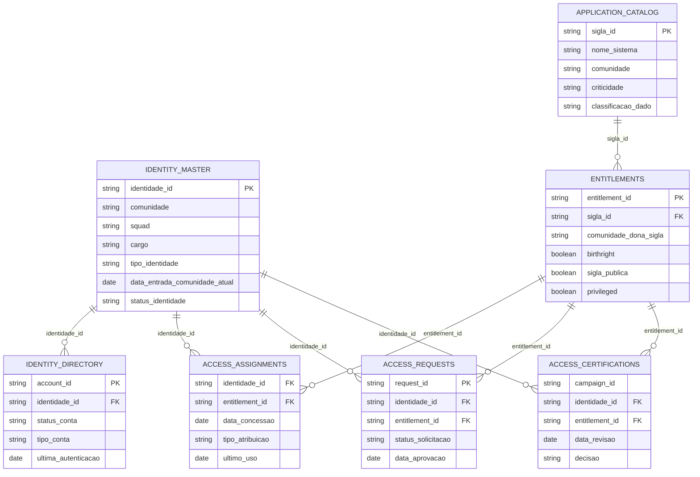
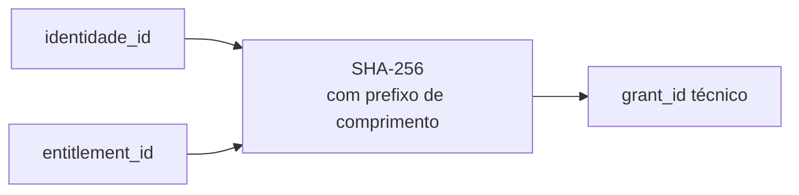
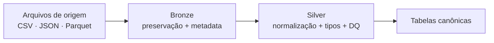
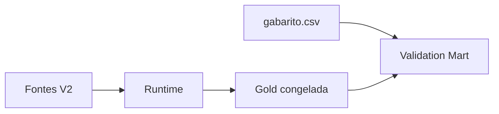

# Modelo de dados sintéticos e contratos

Esta página documenta o **modelo de dados usado pela POC V2**, desde as fontes sintéticas até a representação canônica consumida pelo pipeline.

O objetivo não é apenas mostrar tabelas. O modelo explicita **o que cada linha representa, chaves, tipos, relações, formatos físicos, domínios e regras de padronização (canonicalização)**.

!!! tip "Do negócio para o modelo"
    Pense nas tabelas como respostas para perguntas simples: **quem é a pessoa? quais contas ela possui? qual é a aplicação? qual permissão existe? quem recebeu a permissão? houve solicitação/aprovação? o acesso foi certificado?**

!!! info "Fonte de verdade"
    Os campos e tipos abaixo refletem o contrato implementado em `src/sod_platform/silver/contract.py`. Quando o contrato e um arquivo de origem divergirem, a execução deve falhar ou encaminhar o problema para qualidade de dados; a documentação não substitui o contrato executável.

## 1. Fontes sintéticas V2

| Fonte canônica | Sistema sintético | Formato | Volume gerado | Nível de detalhe principal |
|---|---|---|---:|---|
| `identity_master` | HR_SYSTEM | CSV | **9.932** | uma identidade |
| `identity_directory` | IDENTITY_PROVIDER | JSON | **9.937** | uma conta |
| `application_catalog` | APPLICATION_CATALOG | CSV | **1.906** | uma sigla/aplicação |
| `iga_entitlements` | IGA_PLATFORM | JSON | **1.906** | um entitlement |
| `iga_access_assignments` | IGA_PLATFORM | Parquet | **75.585** | identidade × entitlement no snapshot |
| `iga_access_requests` | IGA_PLATFORM | Parquet | **2.671** | uma solicitação |
| `access_certifications` | ACCESS_GOVERNANCE | Parquet | **18.894** | uma decisão de campanha sobre identidade × entitlement |

Os formatos heterogêneos são intencionais: a POC exercita ingestão de CSV, JSON e Parquet antes da canonicalização.

!!! note "Por que aparecem contagens diferentes de grants?"
    Existem três números que representam **estágios diferentes**, e não devem ser tratados como a mesma métrica:

    - `access_assignments` na fonte: **75.585** registros;
    - o relatório auxiliar `generation_report_v2.json` registra `grant_count = 75.583`, após considerar as **2 duplicatas**;
    - a Silver canônica trabalha com **75.577 grants**, após retirar também **3 referências de identidade inválidas** e **3 referências de entitlement inválidas**.

    A reconciliação comprovada no run final é:

    ```text
    75.585
      - 2 duplicados
      - 3 referências de identidade inválidas
      - 3 referências de entitlement inválidas
    = 75.577 grants canônicos
    ```

    Assim, a diferença fonte → canônico está associada a controles conhecidos de qualidade e integridade, e não a perda silenciosa de registros.

## 2. Modelo lógico



!!! note "Relações lógicas, não constraints de banco"
    O ERD descreve como o pipeline relaciona as entidades. A POC usa arquivos + Iceberg/Spark; essas relações são verificadas por contratos, DQ e joins, não por foreign keys físicas de um banco relacional.

## 3. `identity_master`

**Papel:** cadastro autoritativo da identidade e do contexto organizacional.

| Campo | Tipo | Significado |
|---|---|---|
| `identidade_id` | string | identificador da identidade |
| `comunidade` | string | comunidade organizacional atual |
| `squad` | string | unidade funcional mais específica |
| `cargo` | string | cargo/função organizacional |
| `tipo_identidade` | string | vínculo, como `employee` ou `contractor` |
| `gestor` | string | gestor da identidade |
| `data_entrada_comunidade_atual` | date | início do contexto organizacional atual |
| `status_identidade` | string | `active`, `inactive` ou `terminated` |
| `data_desligamento` | date | data de término do vínculo, quando aplicável |

## 4. `identity_directory`

**Papel:** representar contas técnicas/diretório ligadas à identidade.

| Campo | Tipo | Significado |
|---|---|---|
| `account_id` | string | identificador da conta |
| `identidade_id` | string | identidade proprietária |
| `status_conta` | string | `active`, `disabled` ou `locked` |
| `tipo_conta` | string | `employee`, `contractor` ou `service` |
| `data_criacao` | date | criação da conta |
| `ultima_autenticacao` | date | último evento de autenticação conhecido |
| `data_bloqueio` | date | bloqueio da conta, quando existente |

Uma identidade pode possuir várias contas; o Access Context agrega essas informações por `identidade_id`.

## 5. `application_catalog`

**Papel:** catálogo das aplicações/siglas e seus atributos de risco.

| Campo | Tipo | Significado |
|---|---|---|
| `sigla_id` | string | identificador da aplicação/sigla |
| `nome_sistema` | string | nome legível do sistema |
| `owner` | string | responsável pela aplicação |
| `comunidade` | string | comunidade responsável |
| `criticidade` | string | LOW / MEDIUM / HIGH / CRITICAL |
| `classificacao_dado` | string | PUBLIC / INTERNAL / CONFIDENTIAL / RESTRICTED |
| `privileged` | boolean | indica contexto privilegiado |
| `regulatory_scope` | string | NONE / SOX / PCI / BACEN / OTHER |

## 6. `iga_entitlements`

**Papel:** catálogo de permissões avaliadas pela solução.

| Campo | Tipo | Significado |
|---|---|---|
| `entitlement_id` | string | identificador do entitlement |
| `sigla_id` | string | aplicação à qual pertence |
| `comunidade_dona_sigla` | string | comunidade proprietária |
| `birthright` | boolean | indica acesso nato |
| `sigla_publica` | boolean | indica fronteira pública |
| `application_owner` | string | owner da aplicação |
| `criticidade` | string | criticidade do contexto |
| `classificacao_dado` | string | sensibilidade dos dados |
| `privileged` | boolean | acesso privilegiado |
| `regulatory_scope` | string | escopo regulatório |

## 7. `iga_access_assignments`

**Papel:** população principal de acessos concedidos.

| Campo de origem | Tipo | Significado |
|---|---|---|
| `identidade_id` | string | identidade que possui o acesso |
| `entitlement_id` | string | entitlement concedido |
| `data_concessao` | date | data da concessão |
| `tipo_atribuicao` | string | forma de atribuição |
| `ultimo_uso` | date | último uso registrado |

### Chave técnica do grant

A fonte física **não fornece `grant_id`**. A Silver cria uma chave determinística:



A saída registra:

```text
grant_id_generated = true
grant_id_generation_method = SHA256_IDENTITY_ENTITLEMENT_V2
```

O uso de prefixos de comprimento antes do hash evita ambiguidades de concatenação. No snapshot atual, o contrato trabalha com **um assignment canônico por par identidade × entitlement**.

## 8. `iga_access_requests`

**Papel:** evidência de solicitação/aprovação.

| Campo | Tipo | Significado |
|---|---|---|
| `request_id` | string | identificador da solicitação |
| `identidade_id` | string | identidade alvo |
| `entitlement_id` | string | acesso solicitado |
| `solicitante` | string | quem solicitou |
| `data_solicitacao` | date | data da solicitação |
| `status_solicitacao` | string | APPROVED / REJECTED / PENDING |
| `aprovador` | string | aprovador |
| `data_aprovacao` | date | data da decisão |
| `motivo` | string | justificativa textual |

Como a origem sintética não fornece uma chave causal `request_id → grant_id`, o Access Context procura candidatos por **identidade + entitlement + coerência temporal** e registra a qualidade do vínculo em vez de fingir certeza.

## 9. `access_certifications`

**Papel:** evidência de revisão/certificação do acesso.

| Campo | Tipo | Significado |
|---|---|---|
| `campaign_id` | string | identificador da campanha |
| `identidade_id` | string | identidade revisada |
| `entitlement_id` | string | entitlement revisado |
| `data_revisao` | date | data da revisão |
| `revisor` | string | responsável pela revisão |
| `decisao` | string | MAINTAIN / REVOKE / PENDING |
| `justificativa` | string | justificativa da decisão |

Quando existem múltiplas certificações válidas até a data de avaliação, o contexto seleciona a decisão temporalmente mais recente e também preserva pendências.

## 10. Bronze → Silver



| Origem física | Tabela canônica |
|---|---|
| `identity_master` | `sod.silver.identity_master` |
| `identity_directory` | `sod.silver.identity_directory` |
| `entitlements` | `sod.silver.iga_entitlements` |
| `application_catalog` | `sod.silver.application_catalog` |
| `access_assignments` | `sod.silver.iga_access_assignments` |
| `access_requests` | `sod.silver.iga_access_requests` |
| `access_certifications` | `sod.silver.access_certifications` |

## 11. Lineage preservado

A Silver preserva metadados técnicos oriundos da ingestão:

| Campo | Papel |
|---|---|
| `_ingestion_id` | identifica a tentativa de ingestão |
| `_source_name` | fonte lógica |
| `_source_file` | arquivo de origem |
| `_source_file_hash` | hash do arquivo |
| `_ingestion_timestamp` | instante da ingestão |
| `_ingestion_date` | data operacional |

Isso permite que o Access Context construa `source_snapshot_id` e que as camadas seguintes preservem rastreabilidade.

## 12. Domínios controlados

Alguns atributos possuem domínios explícitos em `configs/data_quality.yml`:

| Atributo | Valores esperados |
|---|---|
| `tipo_identidade` | employee, contractor |
| `tipo_atribuicao` | detectado, atribuido |
| `status_identidade` | active, inactive, terminated |
| `status_conta` | active, disabled, locked |
| `tipo_conta` | employee, contractor, service |
| `status_solicitacao` | APPROVED, REJECTED, PENDING |
| `decisao` | MAINTAIN, REVOKE, PENDING |
| `criticidade` | LOW, MEDIUM, HIGH, CRITICAL |
| `classificacao_dado` | PUBLIC, INTERNAL, CONFIDENTIAL, RESTRICTED |
| `regulatory_scope` | NONE, SOX, PCI, BACEN, OTHER |

## 13. Onde o ground truth fica

O gabarito sintético **não faz parte desses contratos de runtime**.



Campos como `cenario`, `classificacao_esperada`, `expected_class` e `ground_truth` são proibidos nos componentes de runtime.

> **O modelo sintético foi desenhado para testar a arquitetura sem permitir que a resposta esperada contamine a decisão.**
