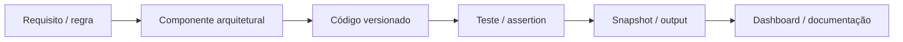

# Rastreabilidade técnica

Esta página conecta **necessidade → componente → implementação → teste**. O objetivo é mostrar que a documentação descreve comportamento verificável no repositório, e não apenas uma arquitetura conceitual.

## Matriz principal

| Necessidade | Componente | Implementação principal | Verificação/teste |
|---|---|---|---|
| ingerir fontes heterogêneas | Bronze | `src/sod_platform/bronze/` | `tests/bronze/test_ingestion_formats.py`, `test_bronze_iceberg.py` |
| validar contrato e tipos | Silver | `src/sod_platform/silver/contract.py` | `tests/silver/test_silver_contract.py` |
| gerar grant técnico rastreável | Silver assignments | `src/sod_platform/silver/accesses.py` | `tests/access_intelligence/context/test_access_context_contract.py` |
| construir contexto factual | Access Context | `src/sod_platform/access_intelligence/context/engine.py` | `tests/access_intelligence/context/test_access_context_contract.py` |
| identificar âncoras explícitas | Hard Trusted Set | `src/sod_platform/access_intelligence/trusted_set/engine.py` | `tests/access_intelligence/trusted_set/test_hard_trusted_set.py` |
| medir padrão observado | Observed Baseline | `src/sod_platform/access_intelligence/baseline/observed.py` | `tests/access_intelligence/baseline/test_observed_baseline.py` |
| tratar grupos pequenos | Hierarchical Fallback | `src/sod_platform/access_intelligence/baseline/fallback.py` | `tests/access_intelligence/baseline/test_hierarchical_fallback.py` |
| classificar expectedness | Expected Access | `src/sod_platform/access_intelligence/expected_access/engine.py` | `tests/access_intelligence/expected_access/test_expected_access.py` |
| organizar fatos e confiabilidade | Evidence | `src/sod_platform/access_intelligence/evidence/engine.py` | `tests/access_intelligence/evidence/test_evidence_engine.py` |
| aplicar decisão determinística | Policy PD002 | `src/sod_platform/access_intelligence/policy/rules.py` + `configs/policy_decision_pd002_1_0_1.yml` | `tests/access_intelligence/policy/test_policy_pd002_1_0_1.py` |
| priorizar sem reclassificar | Risk | `src/sod_platform/access_intelligence/risk/engine.py` + `configs/risk.yml` | `tests/access_intelligence/risk/test_risk.py` |
| publicar assessment final | Gold | `scripts/runtime/run_v2_gold.py` | `tests/gold/test_v2_gold_validation_mart.py` |
| controlar dependências | Airflow | `orchestration/airflow/dags/sod_runtime_v2.py` | gates e assertions dos scripts runtime |
| observar execução | Observability | `src/sod_platform/observability/access_intelligence.py` | `tests/observability/test_access_intelligence_observability.py` |
| validar sem leakage | Validation Mart | `scripts/validation/run_v2_validation_mart.py` | `tests/gold/test_v2_gold_validation_mart.py` |
| disponibilizar consumo | Streamlit | `apps/streamlit/` | `tests/streamlit/test_dashboard.py`, `test_page_smoke.py` |

## Fluxo de rastreabilidade



## Configuração também é código

Parte relevante da lógica é versionada fora do Python:

| Configuração | Papel |
|---|---|
| `configs/data_quality.yml` | domínios e contratos de DQ |
| `configs/access_intelligence.yml` | parâmetros de baseline/fallback/Expected Access |
| `configs/evidence_engine.yml` | contrato do Evidence Engine |
| `configs/policy_decision_pd002_1_0_1.yml` | catálogo e precedência de regras de Policy |
| `configs/risk.yml` | pesos, bandas e drivers de risco |

Isso permite revisar uma mudança de comportamento sem esconder parâmetros dentro do código.

## O DAG como fonte operacional de verdade

A existência de um módulo no repositório não significa que ele participa do runtime.

O caminho canônico é materializado por:

`orchestration/airflow/dags/sod_runtime_v2.py`


Os componentes experimentais de clustering/graph/peer discovery existem no código, mas permanecem fora desse caminho canônico na Fase 1.

## Evidência de que runtime e validação são separados

O runtime proíbe campos como:

```text
scenario
cenario
classificacao_esperada
ground_truth
expected_class
offline_label
```

O `Validation Mart` só é executado sobre a **Gold já congelada**.

Isso cria uma cadeia verificável:

```text
regra documentada
→ código
→ teste
→ execução
→ snapshot
→ validação
```

## Como usar esta página em uma revisão técnica

Para qualquer comportamento importante da solução:

1. localize a necessidade nesta matriz;
2. abra o componente correspondente no repositório;
3. verifique configuração e teste associado;
4. confirme o estágio no DAG;
5. consulte os resultados da POC e a observabilidade.

Esse caminho reduz a distância entre **documentação, arquitetura e implementação real**.
